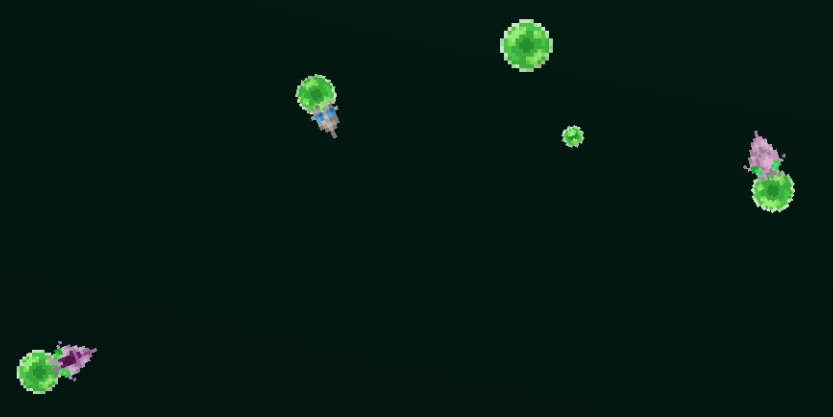
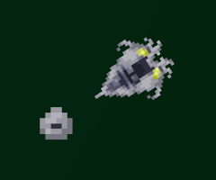
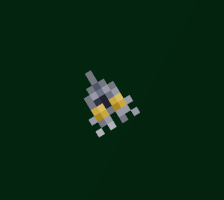
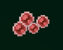
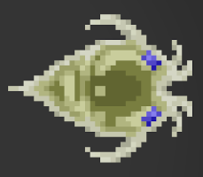
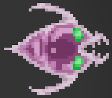
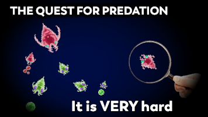

# Alife Project: The bibites

## Introduction by the author

*by Leo Caussan*

[The Bibites](https://leocaussan.itch.io/the-bibites) is an Artificial Life Project that emulates biological processes, physics, and mutation of both phenotypical and behavioral characteristics, resulting in evolution.

The Bibites eat to gain energy, which they must expend to sustain their metabolism, move around, grow, reproduce, and do other things.

*Bibites of different species feeding on plant pellets*

The Bibites is an evaluation-less simulation, what survives best is what is selected for. The bibites reproduce biologically, expending energy to produce offspring, which may present mutations. This results in natural selection.

*A bibite with an egg it just laid (left) and the result young bibite that later came out of that egg (right)*

On death, the bibites release the energy they contain (the energy they used to grow, their stored energy, etc.) is released in the form of meat pellets, which are also a potential food source for the bibites.

However, one of the genes a bibite can mutate is its diet. Basically, it’s a gene that ranges from fully herbivorous to fully carnivorous. Depending on their affinity toward a particular food source, they will be more or less efficient at extracting the energy out of that source, even potentially losing energy if they are incompatible enough.

*Note the different mouthparts between herbivores (left) and carnivores (right)*

With this possibility, I’ve always wanted predation to develop naturally in the simulation, but never actually managed to see it arise.
That’s why I decided to launch an epic journey to uncover what dynamics are lacking in the simulation in order for predation to be a possible development.
And if a picture is worth a thousand words, here’s a video that must be worth at least a million words. [The Evolution of Predation in a Simulated Ecosystem](https://www.youtube.com/watch?v=rPkMoFJNcLA)

## Impressions by a User

*by Joao Guilherme (twitter: @_joaogui1))*

The Bibites: Digital Life (or just Bibites) is a very interesting Alife project. The system's main individuals are bibites, virtual cratures capable of movement, reproduction, feeding and evolution. They each have genes, which are passed to their children during reproduction, and "brains", simple neural networks that dictate their behaviour. There are a couple of fruitful ways to interact with the project, among them I've done 2:  Watching the youtube videos made by the developer and downloading the software and running your own simulations. On the channel one may find videos about the inner workings of the bibites, or about how ecological properties properties arise in the simulation, like herding, altruism, and in the newest series predation.  Playing with the simulations is also greatly rewarding, it's quite flexible and allows one to truly formulate hypothesis and explore their validity.
So overall, while not as mathematically or academically elegant as Lenia, I believe Bibites is a great example of an Alife project, and I recommend other members of the community play with the simulations and interact with the author on twitter and Reddit, to help shape future explorations.
