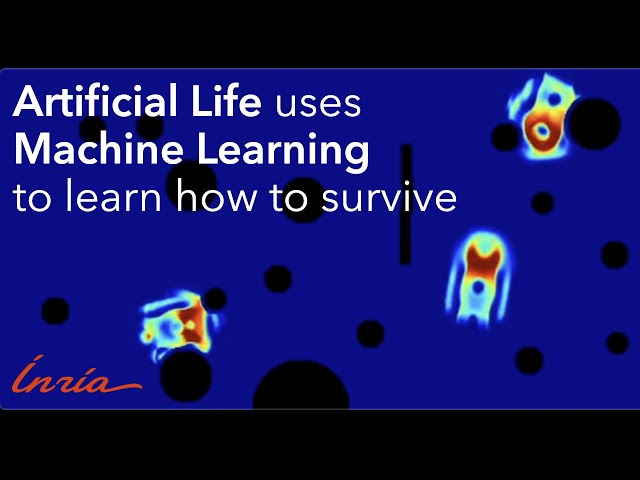

# Paper: Learning Sensorimotor Agency in Cellular Automata
**Website:** https://developmentalsystems.org/sensorimotor-lenia/ 

*by Gautier HAMON, INRIA FLOWERS*

In this blogpost, we propose an approach enabling to learn self-organizing agents capable of reacting to the perturbations induced by the environment, i.e. robust agents with sensorimotor capabilities. We provide a method based on curriculum learning, on diversity search and on gradient descent over a differentiable CA able to discover the rules leading to the emergence of such creatures.
