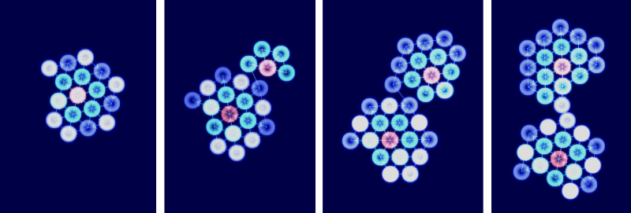
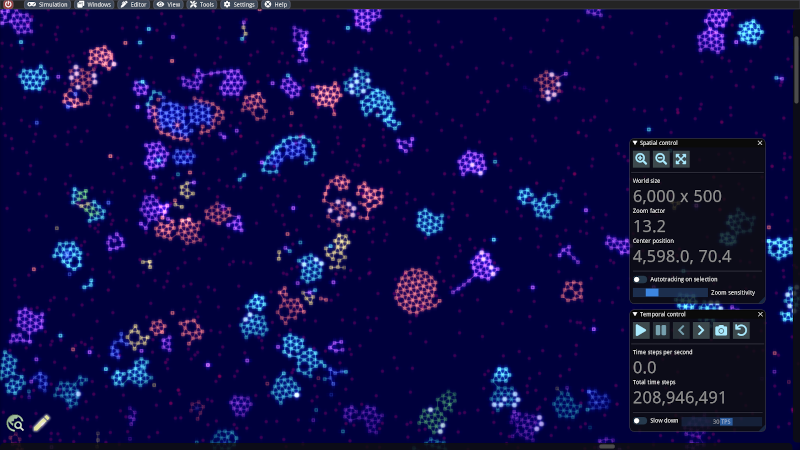

# Alife Art: Project ALIEN

*Contributed by Christian Heinemann*

[ALIEN](https://alien-project.org) is an open-source artificial life project which aims to bring together particle-based simulations for soft bodies with a programming model for distributed systems. In this context, agents are networks of connected particles, where the nodes possess capabilities that could be attributed to robotic or biological components: sensors, muscles, computational units and much more. The communication inside a particle network is performed by signals consisting of stateful and transient entities. They facilitate more complex behavior patterns such as food seeking, self-replication, controlled movements, attacking and digestion of resources, swarming behavior, etc. to be implemented in the networks. The simulator comes along with various examples ranging from pure mechanical to evolution simulations to play with. Own particle machines can be constructed with the built-in graph editing and programming environment. For instance, a self-replicating machine provided with enough resources could work as follows:

From left to right: a possible replication cycle of a particle machine The replication process for this machine takes place in such a way that, starting from a center node, its own network structure is scanned and reconstructed in a spiral sequence. By injecting such a machine equipped with a functioning metabolism into a pristine world exposed to mutations, evolution simulations can be conducted. If desired, the user of the program can merely act as an observer and adjust some simulation parameters from time to time.

The color of a particle has become more importance in recent updates. There are several color flavors available, and they can play a crucial role in the sensoring and digesting functions depending on the simulation setting. In this long-term diagram taken from the built-in simulation monitor, for instance, one can see how populations of replicators with different colors have gained the predominance at different time epochs.

An objective of this project is to encourage experimentation with worlds full of wonders that keep surprising the observers. ALIEN is powered by an own physics and rendering engine written in CUDA and thus requires an Nvidia graphics card.
