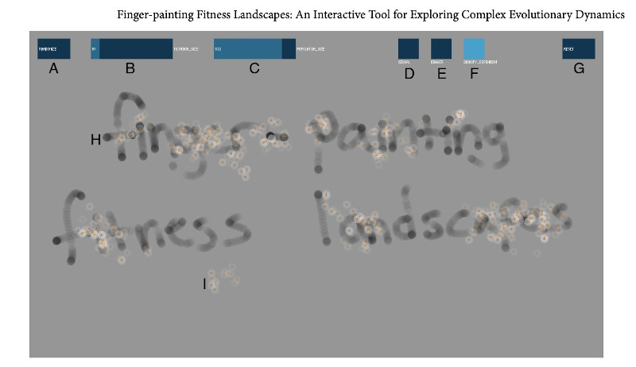
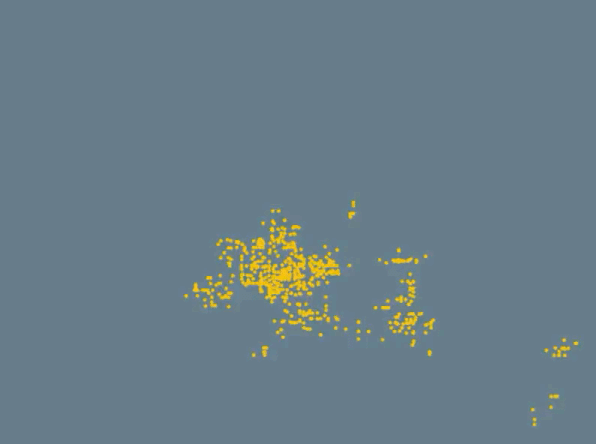
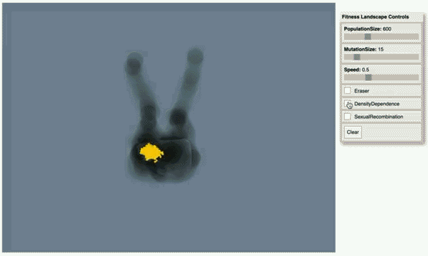
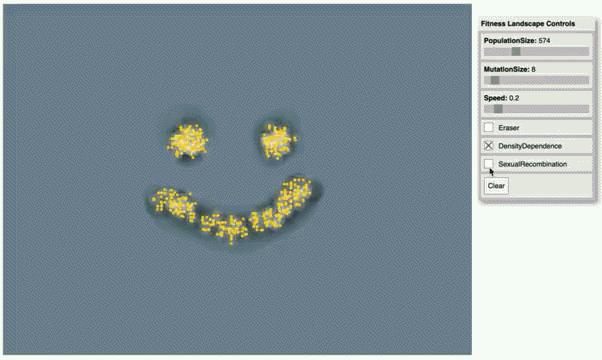
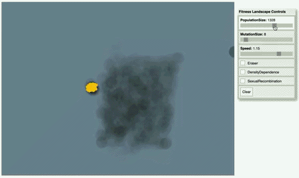

# Project Highlight: Fingerpainting Fitness Landscapes
*Contributed by [Luis Zaman](https://twitter.com/LuisZaman), [Original Twitter Thread](https://twitter.com/LuisZaman/status/1495251969094602755?t=vWoC0E0_AcBRkNYh3IgnRA&s=19)*

While I was a graduate student, I had a bit of fun one weekend and made a touch screen simulation to play with fitness landscapes. @RELenski, @CharlesOfria, and I wrote about this tool back in 2012. [Now a version lives online](https://zeeelab.github.io/FingerpaintingFitnessLandscapes.js/)!

You can watch a population evolve in your browser! Here, we're watching the population neutrally move around the fitness landscape. Note how correlations in the fitness landscape emerge from coalescing lineages.

By painting in the canvas, you can create regions of higher fitness and watch as the population climbs new peaks.

You can "poke" the population by erasing regions of high fitness, and watch as individuals seemingly scurry to find high fitness regions!

We can see what happens if fitness is density dependent, where organisms depress the fitness landscape locally. This is depicted (and mechanistically implemented) by lightening the fitness landscape around each individual.

Sexual recombination is a great way to increase variation, but it can also collapse diversity where hybrid organisms "fall off" high fitness regions. We can see that directly in cute fitness landscapes!

And one of my favorite fitness landscape phenomenon, survival of the flattest at high mutation rates, is easy to recreate! We can see the population favor the large but less fit region as we crank up the mutation rate.

I hope to keep adding to this (e.g., coevolution!), but please let me know if you have ideas. I'm certainly planning a few lessons in my classes using this, but would love to hear if others are interested!

(Addendum: [Co-evolution has been added!](https://zeeelab.github.io/FingerpaintingFitnessLandscapes.js/coevolution.html))
