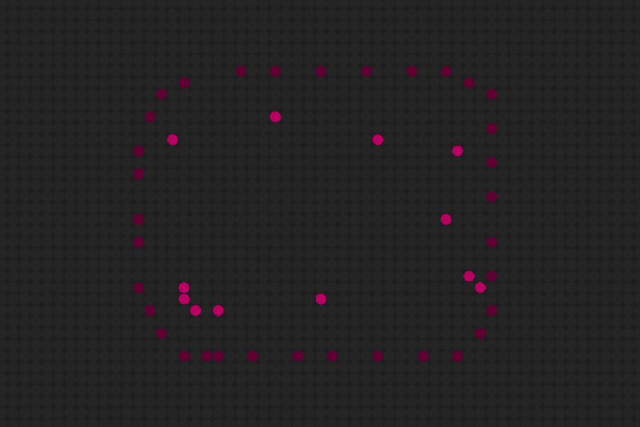

# Project Highlight: MFM.rocks
*Contributed by [Andrew Walpole](https://twitter.com/walpolea)*

If you're unfamiliar with Dave Ackley's Movable Feast Machine (MFM), it's a radically different architecture; an entirely new computational stack of hardware and software. An indefinitely-scalable, non-deterministic, tiled grid system meant to free itself from the fragility and constraints of a centralized computational model. (You can learn more about Dr. Ackley's system via [the T2 Tile Project](https://t2tile.com/), where over the last 3+ years he has video-documented his journey of building a hardware-based indefinitely scalable MFM grid.)

[Mfm.rocks](https://mfm.rocks) is my playground of sorts; an exploratorium for this uncharted computational model. Not quite having the confidence or know-how to dive into Dr. Ackley’s platform directly, the underlying mfm-js library was born out of an insatiable yearn to explore MFM concepts first-hand. And recently I’ve completely rewritten the [library (mfm-js 2.0)](https://github.com/walpolea/mfm-js) to be substantially more performant, allowing for bigger grids and more play!

Most notably, the bug that really bit me was the idea that in a robust-first environment, we will need to lean into living-systems concepts – regeneration, organic growth, reproduction, systems-thinking – in order to build software that can resiliently compute within a hostile digital environment. And while I can’t say there is too much useful computing going on as of yet, exploring lower-level living-systems concepts is unlocking ideas. Here are a few of those elemental explorations.

## Directionals

Directionals are the name I’ve given to grid travelers that use a sense of understanding directional heading, allowing for the ability to turn left or right or reverse on the grid. Here are a few: Fly, Mosquito, Bird and Wanderer.

[VIEW DIRECTIONAL DEMO](https://mfm.rocks/?size=128,64&speed=1&selected=FLY&atoms=FLY-15x11-15x46-38x33,MOSQUITO-58x15-58x56-70x31-71x53-85x17,BIRD-99x23-120x11,WANDERER-113x51-113x52-113x53-114x51-114x52-114x53-115x51-115x52-115x53)

## Directors

Directors, which can influence the heading of any Directional show how we might create spatial structures that lead a computational workflow.

[VIEW DIRECTOR DEMO](https://mfm.rocks/?size=128,64&speed=1&selected=WANDERER&atoms=DIRECTOR%20S-40x21-40x23-40x27-40x29-40x33-41x18-42x16-44x15,DIRECTOR%20E-41x35-42x37-44x39-46x39-47x39-50x39-54x39-57x39-61x39-65x39,WANDERER-43x23-44x18-44x30-46x35-52x37-53x16-59x38-60x16-66x37-68x17-69x26-69x34,DIRECTOR%20W-49x14-52x14-56x14-60x14-64x14-67x14-69x15-71x16-71x19,DIRECTOR%20N-68x39-70x37-71x22-71x25-71x29-71x32-71x35)

## Looper

Looper is really a culmination of both concepts, a Directional itself, it loops around leaving a trail of goop and Directors that traps any unsuspecting nearby Directional.

[VIEW LOOPER DEMO](https://mfm.rocks/?size=128,64&speed=1&selected=MOSQUITO&atoms=MOSQUITO-28x30-28x31-28x32-28x33-29x30-29x31-29x32-29x33-30x30-30x31-30x32-30x33-31x30-31x31-31x32-31x33,LOOPER-92x32)

## OfSwamp

OfSwamp has a Cell-like composure, but it came aobut as an exploration of Environments and Systems. Swampling will loop around and set up a Swamp environment where all OfSwamp types can freely traverse within, while non-swampkind have a much tougher time intruding. I had approached cell building in the past, but through the lens of an environment the concepts used to put this together ended up being very different.

[VIEW OFSWAMP DEMO](https://mfm.rocks/?size=128,64&speed=1&selected=EMPTY&atoms=MOSQUITO-9x31-16x14-21x48-37x55-55x33-69x19-84x30-92x47-109x55-120x31,SWAMPLING-31x26-33x25-33x28-64x43-65x42-95x25)

## ForkBomb

ForkBomb is sort of the infinite loop of the MFM grid, unabashedly consuming everything in its endless wake.

[VIEW FORKBOMB DEMO](https://mfm.rocks/?size=128,64&speed=1&selected=FORKBOMB&atoms=FORKBOMB-64x32)

## AntiForkBomb and Sentry

But Sentry, who spits out AntiForkBomb, can easily put a stop to this menace.

[VIEW ANTIFORKBOMB DEMO](https://mfm.rocks/?size=128,64&speed=1&selected=FORKBOMB&atoms=FORKBOMB-22x31,SENTRY-118x30-121x22-123x38)

## Living Wall

While some structures that are less robust easily get wiped out by ForkBomb, a Living Wall structure knows how to heal itself a bit as long as there are a few Sentry to keep it from getting entirely overridden.

[VIEW LIVING WALL DEMO](https://mfm.rocks/?size=128,64&speed=1&selected=FORKBOMB&atoms=FORKBOMB-22x31,LIVING%20WALL-67x19-67x20-67x21-67x22-67x23-67x24-67x25-67x26-67x27-68x18-68x19-68x20-68x21-68x22-68x23-68x24-68x25-68x26-68x27-68x28-69x17-69x18-69x19-69x20-69x21-69x22-69x23-69x24-69x25-69x26-69x27-69x28-69x29-70x16-70x17-70x18-70x19-70x20-70x21-70x22-70x26-70x27-70x28-70x29-71x16-71x17-71x18-71x19-71x20-71x27-71x28-71x29-72x16-72x17-72x18-72x19-72x27-72x28-72x29-73x16-73x17-73x18-73x19-73x27-73x28-73x29-74x16-74x17-74x18-74x19-74x27-74x28-74x29-75x16-75x17-75x18-75x19-75x26-75x27-75x28-75x29-76x16-76x17-76x18-76x19-76x20-76x21-76x26-76x27-76x28-76x29-77x17-77x18-77x19-77x20-77x21-77x22-77x23-77x24-77x25-77x26-77x27-77x28-78x18-78x19-78x20-78x21-78x22-78x23-78x24-78x25-78x26-78x27-78x28-79x20-79x21-79x22-79x23-79x24-79x25-79x26-79x27-80x21-80x22-80x23-80x24,SENTRY-72x22-74x21-74x24)

It’s only been a few months of working with mfm-js 2.0 and I’m only just getting started with this new set of living-systems experiments. I would like to explore more around regeneration, and building computational systems using specialized structures and elemental environments on the grid. There are also more elements and demos available over on the 1.0 version (most notably, SwapWorm and CellBrane) which is still available to check out at https://mfm.rocks/v1/ as well as the game, Dungeon Grid, I built on top of the mfm-js library https://mfm.rocks/v1/game/. The project is open source and I welcome anyone interested in building elements to jump in. If you have any questions you can find me, Andrew Walpole, on [twitter](https://twitter.com/walpolea) or [the T2 Tile Discord Server](https://discord.gg/rBV6Y6sWNY)!
