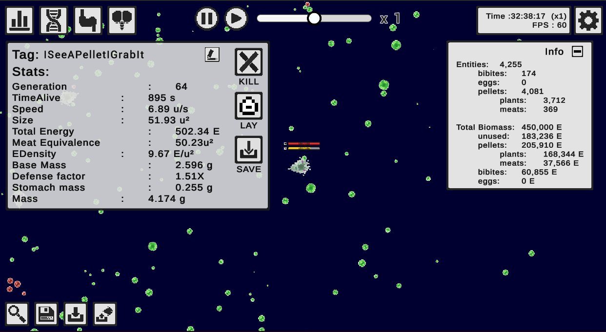

# Running a Life Simulation for 60 hours!
*by [Claus Aranha](https://scholar.social/@caranha)*

Remember [The Bibites](https://leocaussan.itch.io/the-bibites), a life simulation that we introduced back in [Edition 04](https://alife-newsletter.github.io/Newsletter/edition_004.html#alife-project-the-bibites)?

A few weeks ago the simulator received an uppdate, so I decided to let a simulation run in my work computer for the week. It was very nice to check on how my bibites had evolved during my work breaks.

*the simulation at around 30 hours*

Because there was no physical separation in the environment where the digital creatures lived, the population quickly converged. However, evolution continued, and it was very interesting to guess when a new mutation would take hold of the population (such as the ability to avoid other bibites), or be lost to genetic drift (such as the expression of colorful pheromones).

By the way, the author of the simulation recently released a similar video, where he follows 100 hours of simulation and prepares a simple phylogenetic tree of the species that came up. He also promised better tools to visualize the simulation, so look forward to that!

- [The result of 100 hours of simulation (Part I)](https://youtu.be/sEPh6bAQVP0)
- [The result of 100 hours of simulation (Part II)](https://youtu.be/xBQ3knSi0Uo)
