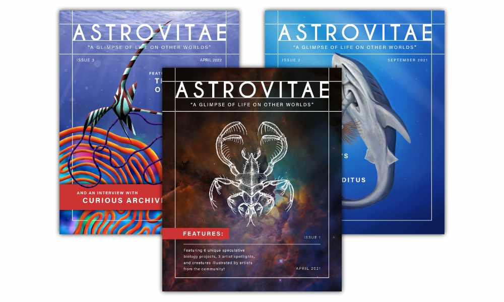
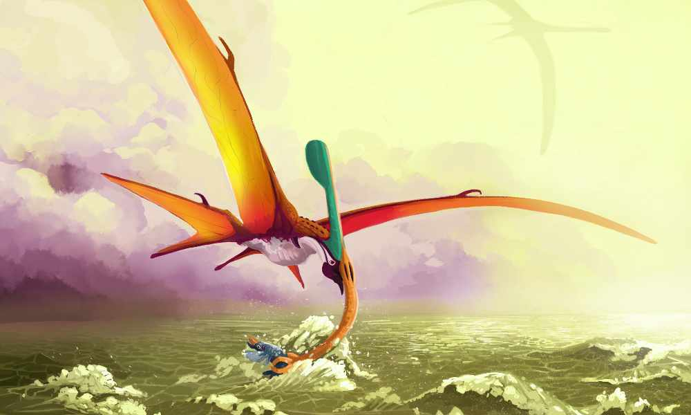
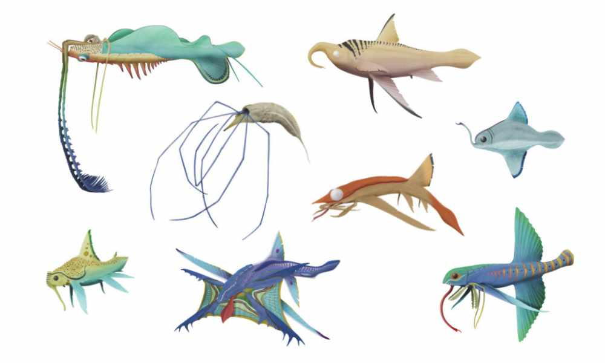
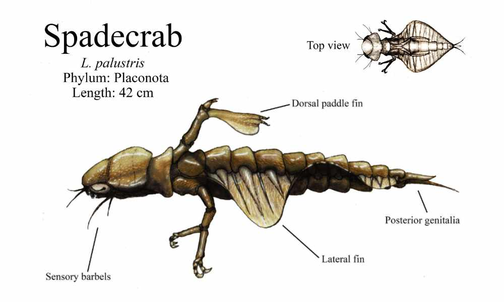
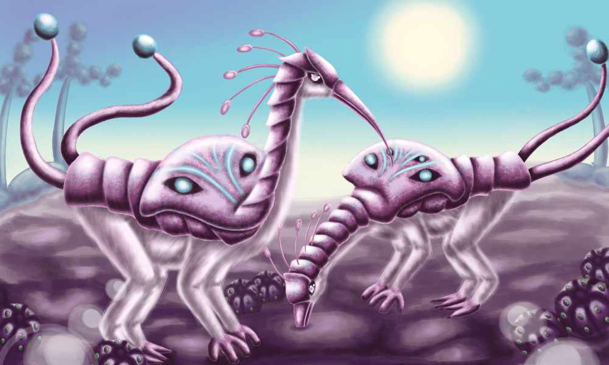

# Astrovitae: The Speculative Biology Magazine
By [Domenic V. Pennetta](https://twitter.com/domenicpennetta)

Hello ALifers! I’m Domenic Pennetta, the founder and editor of [Astrovitae Magazine](https://www.astrovitae.com/)—an online publication focused on popularizing the genre of fiction called [speculative biology](https://en.wikipedia.org/wiki/Speculative_evolution) (specbio). Many of you have seen the first images taken by the [James Webb Space Telescope](https://webbtelescope.org/), which recently made headline news around the globe. Now humanity can gaze into the universe once more, but this time with more accuracy and clarity. Looking at the vastness of space—taking in all of the brightly-lit stars, nebulas, and funny shaped galaxies… brings up a nagging question: Where is all the life?

Specbio artists take this question to heart. The universe is, no doubt, full of life. We just haven't found it yet! And since alien life is most certainly out there, then what does it look like? Astrovitae’s mission is to gather up all these curious minds—all sharing the same goal of exploring what alien or alternate Earthly life could be—and put them in one place. This nexus of creatives fosters collaboration and a strong sense of community, while also providing many with thoughtful biology-inspired entertainment. With a slogan like “life as it could be'', I’m confident that many ALifers can sympathize with specbio artists and our search for a different form of life.

*“Crested Snout Skimmer”, by [Pierce Adams](https://www.instagram.com/pierce_adams_art).*

## What is Astrovitae Magazine All About?

Astrovitae is a FREE, digital magazine focused on showcasing topics involving speculative biology, art, and science fiction. The magazine releases biannually, with a new issue planned to appear every April and September. The magazine is not peer reviewed, and there is no masthead or advisory board—the founder of the magazine is currently the only editor (who occasionally receives outside help from friends and other artists). The very first issue debuted in April of 2021 amid the global pandemic, and so far, there have been three published issues featuring a variety of artists and projects. Issue 4, which is now in the works, releases this coming September! New issues can be found on the magazine’s website: [www.astrovitae.com](https://www.astrovitae.com).

[READ PAST ISSUES](https://www.astrovitae.com/issues.html)

## What’s Inside an Issue?
Inside a typical Astrovitae issue are three main categories:

- **Captivating Worlds**: This is the primary content in Astrovitae where specbio artists showcase their unique world, biomes, and creature designs. *Captivating Worlds* contains the most detailed representation of a specbio project.
- **Artist Spotlight**: *Artist Spotlight* is typically less refined—focusing on the "behind the scenes" of a speculative project. Creators have an opportunity to speak about their creative process, inspirations, and can also show off sketches and unfinished art.
- **Creature Compendium**: This section is exactly what it sounds like—it's a collection of various creatures by participating artists! These organisms are often accompanied by a brief description that gives the reader a small snippet into another speculative world.

*“A Variety of Enetodontians”, by [Lorenzo Battilani](https://www.deviantart.com/blackfrog96).*

There are also other segments included in Astrovitae, such as Spec News—a section that updates readers on some of the going-on’s in the community, like newly announced specbio projects, youtube content, video game releases, and science news associated with astrobiology, paleontology, and other fields.

Astrovitae occasionally features larger creators in interviews, such as [Jay Eaton](https://twitter.com/JayRock5858), one of the founder’s of the specbio zine called Almost Real, and the popular Youtuber [Curious Archive](https://www.youtube.com/c/curiousarchive). Some other notable people in the genre may be interviewed in the future, like the vertebrate paleontologist Darren Naish, artists C.M. Kosemen and Wayne Barlowe, and maybe one day the father of speculative biology himself, Dougal Dixon.

*“Anatomy of a Spadecrab”, by [Hunter Welch](https://www.deviantart.com/pesterjelly).*

**How Can ALifers Submit to Astrovitae?**

Any ALifer interested in speculative biology may send a submission! Creating submissions does not require an art or science degree, nor do you have to be a professional artist to submit work. However, Astrovitae does prefer submissions that include artistic visuals to engage its readers—so if you’re just an author-type, then it might be best to hold off on a submission unless you’d like to collaborate with artists. One of Astrovitae’s missions is to foster collaboration among creators, so working with other individuals in the community is highly encouraged!

If you’re interested in sending a submission to Astrovitae, then visit [www.astrovitae.com/submissions](https://www.astrovitae.com/submissions) to see the magazine’s official guidelines and additional information, like deadlines, word counts, image requirements, and more. Contributors are encouraged to read past issues to see what type of content is typically accepted. Send submissions to [astrovitaeofficial@gmail.com](mailto:astrovitaeofficial@gmail.com) with the subject line “ASTROVITAE SUBMISSION'' followed by your project’s or article’s name.

*“The Tokabi”, by [Maryana Simpson](https://www.instagram.com/art_of_maryana_s).*

## How Can I Support the Magazine?
There are a few ways to support Astrovitae:

- Spread the news! Word of mouth is the best form of marketing, so tell your friends, family, and peers about the magazine!
- Participate by creating your own submission! And don’t hesitate to encourage others to submit work of their own!
- Like, comment, and share [Astrovitae’s Instagram posts](https://www.instagram.com/astrovitae_official).
- Donate to [Astrovitae’s Kofi](https://ko-fi.com/astrovitae) to support the editor’s efforts to popularize the genre and contributing artists!

Regarding donations, Astrovitae is not sponsored and currently makes no revenue from ads or sales. The magazine is absolutely FREE to read in its current state. Donations go a long way to help facilitate the production and marketing of an issue. You can donate a meager $3 (USD) or more to help support the magazine’s mission to showcase specbio artists in the community. If you're interested in donating, visit [Astrovitae's Kofi](https://ko-fi.com/astrovitae) to send a donation. Make sure to leave a comment about your favorite artist or project featured in the magazine!
