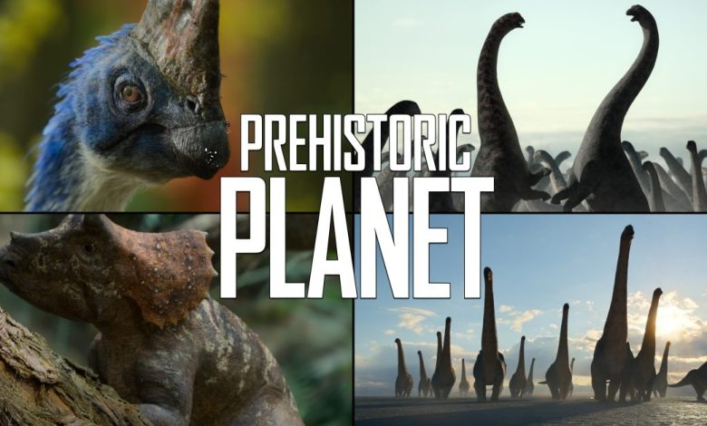

# Media Review: Prehistoric Planet

By [Albert Chen]([https://twitter.com/albertonykus](https://linktr.ee/albertonykus)

<em>The following is modified from a [longer review](https://albertonykus.blogspot.com/2022/06/prehistoric-planet.html).</em>
<em>Prehistoric Planet</em>, a new documentary series now available for streaming on Apple TV+, has caused quite the stir in the online paleontology community. With its focus on reconstructing extinct life in ancient environments, this show inevitably invites comparisons to <em>Walking with Dinosaurs</em> (1999), but it borrows more from recent documentaries that focus on the modern biosphere, such as <em>Planet Earth</em> (2006) and its sequels. For example, each episode of <em>Prehistoric Planet</em> comprises several vignettes that take place in multiple locations, instead of revolving around a narrative about one specific ecosystem. In addition, the segments in <em>Prehistoric Planet</em> are all set within the Maastrichtian Age of the Late Cretaceous Epoch (spanning 72.1–66 million years ago, shortly before the mass extinction event that would end it all), not spread across the entire Age of Dinosaurs.

Most responses to <em>Prehistoric Planet</em> have been overwhelmingly positive, and the acclaim is well deserved. The series features spectacular visual effects as well as naturalistic, scientifically plausible depictions of extinct animals. An excellent example is the adorable portrayal of the small, feathered <em>Mononykus</em>, which appears in the second episode (“Deserts”) and is arguably one of the breakout stars of the series, with even executive producers [Jon Favreau](https://www.youtube.com/watch?v=l8xyqhuz3Wg&t=1257s) and [Mike Gunton](https://www.youtube.com/watch?v=MbNZhVM8ICw&t=163s) identifying it as one of their favorite dinosaurs that they featured. This dinosaur belongs to a group called the [alvarezsaurids](https://en.wikipedia.org/wiki/Alvarezsauridae), characterized by their slender skulls, long legs, and most unusually of all, incredibly short but powerful arms that each end in an enlarged thumb claw. In <em>Prehistoric Planet, Mononykus</em> is shown [traveling for long distances while foraging](https://www.biotaxa.org/Zootaxa/article/view/zootaxa.2413.1.1/0), [detecting prey with its sensitive hearing](https://www.science.org/doi/10.1126/science.abe7941), and using its specialized thumb claw to [dig for termites](https://www.cambridge.org/core/journals/paleobiology/article/abs/function-in-the-stunted-forelimbs-of-mononykus-olecranus-theropoda-a-dinosaurian-anteater/6823FD1CA0FDE6F376621C52A014BF1A) in [dead wood](https://www.sciencedirect.com/science/article/pii/S0195667108000943), all of which are behaviors that have been suggested for alvarezsaurids based on studies of their functional anatomy and ecology.

If I had any notable criticisms of <em>Prehistoric Planet</em>, it would be the fact that this extensive scientific background is probably not apparent to viewers unfamiliar with dinosaur paleontology, as the show generally does not clarify which elements are speculation and which are backed by direct evidence. Each episode does have an accompanying 5-minute “Uncovered” video that delves into some of the science behind the series, but each of these segments focuses only on a single narrow topic, leaving the majority of what is shown in the episodes unaddressed. If anything, a lack of transparency does a disservice to the tremendous amount of thought and research that clearly went into this show.

This point of concern, however, does not undermine the excellence that <em>Prehistoric Planet</em> has achieved. The series is outstanding in nearly every way possible, setting a new and extremely high standard for works of this genre. Given the positive reception so far, I feel hopeful that we will eventually see future seasons of <em>Prehistoric Planet</em> and, with luck, maybe even a whole new age of paleontology-inspired media.

