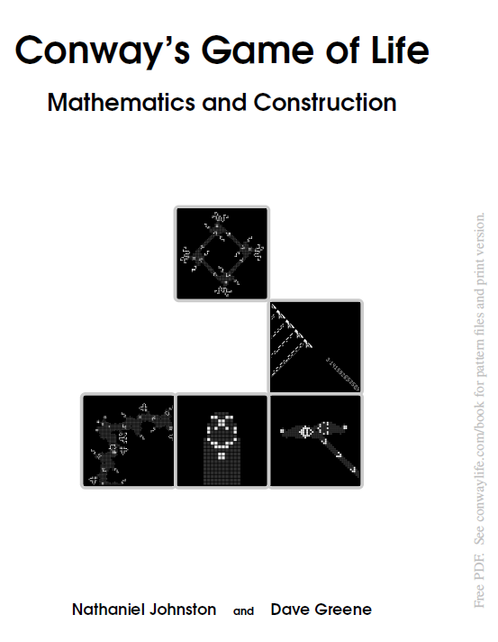

# Conway's Game of Life
## Mathematics and Construction
[A free book](https://conwaylife.com/book/) by Nathaniel Johnston and Dave Greene

Blurb by [Nathaniel Johnston](http://www.njohnston.ca/)

This book provides an introduction to Conway's Game of Life, the interesting mathematics behind it, and the methods used to construct many of its most interesting patterns. The book starts by exploring many of the well-known patterns like blinkers and gliders, but quickly shifts its focus to the problem of combining these various components into complicated mega-structures that can perform unexpectedly complex tasks. In particular, the books guides the reader through the construction of patterns that are able to perform arbitrary computations, are able to create copies of themselves, and even patterns that mimic biological cells by having a central helix of DNA that controls its behavior and replication cycle.

While the book largely follows the history of the Game of Life, that is not its primary purpose. Rather, it is a by-product of the fact that most recently discovered patterns build upon patterns and techniques that were developed earlier. The goal of this book is to demystify the Game of Life by breaking down the complex patterns that have been developed in it into bite-size chunks that can be understood individually.

(Comment by Lana: Not only is the book free, but you can run every game of life patterns from the book by copy pasting the code in a web-based game of life engine like https://golly.sourceforge.net/!)

