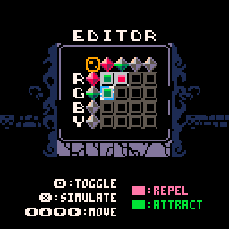
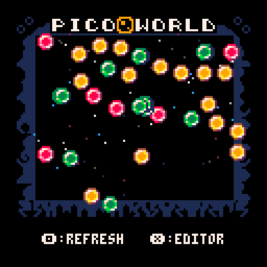
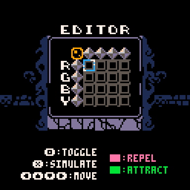
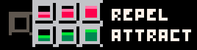

# Picoworld
by Lj Miranda ([@ljvmiranda921](https://twitter.com/ljvmiranda921))

[**Picoworld**](https://ljvmiranda921.itch.io/picoworld) is a PICO-8 simulation
that explores the concept of *emergence* and *self-organization*. In this
sandbox game, you define a set of particles and their interaction rules.
Particles, by themselves, can only attract or repel one another. However, from
these simple interactions, we can observe complex phenomena.

I chose Pico-8 as the game engine for Picoworld because I like its small and
portable nature--like a petri dish! However, developing on Pico-8 requires you
to lean into its constraints: you are limited to a 16-color palette, a 128x128
pixel resolution, and a set amount of programming tokens. This forces me to be
more deliberate in what features I need to add (or remove). It pushes me to
achieve simplicity, and what's fun is that just like any ALife concept,
simplicity can lead to emergent complexity.

The way Picoworld works is that you have four different types of colored
particles. Using the editor, you can define how many particles of each type to
spawn and their corresponding interaction (attraction/repulsion). You can do
this by toggling the symbol in the editor until you reach the desired value:

Because of Pico-8 constraints, there is only a set number of population and
attraction/repulsion strength available. However, these are already enough to
create fun simulations! 

My goal for Picoworld is to encourage experimentation on this artificial life
system. If you discover interesting patterns, feel free to share a screenshot of
the configuration as a comment on the itch.io page! Lastly, I love working in
ALife and collective intelligence, so you can check out my other works!
[[1](https://github.com/ljvmiranda921/pyswarms)]
[[2](https://ljvmiranda921.github.io/sprites-as-a-service/)]

