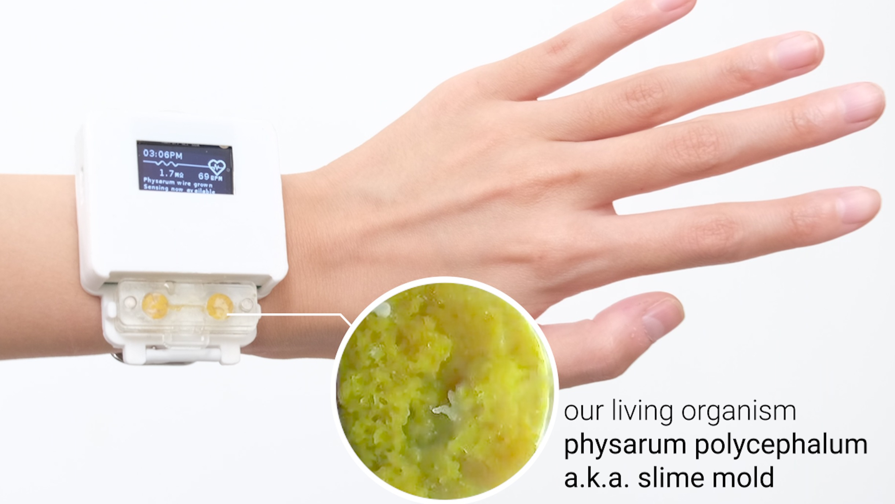
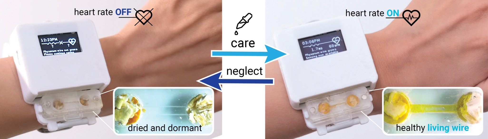

# Paper: “Integrating Living Organisms in Devices to Implement Care-based Interactions”
By [Jasmine Lu](https://twitter.com/xjasminelu) and [Pedro Lopes](https://twitter.com/plopesresearch) (University of Chicago's Human Computer Integration Lab)

In this paper, we explore how embedding a living organism (in this case a slime mold, Physarum Polycephalum) as a functional component of a device, changes the user-device relationship. In our design, the user needs to care for the living organism (by providing food and water) in order for the device to work. When healthy, the organism participates in the device’s functionality by acting as a physical wire that enables power to the watch’s heart rate sensor. As such, caring for the device is intrinsic to its interaction design —with the user’s care, the slime mold becomes conductive and enables the sensor; conversely, without care, the slime mold dries and disables the sensor, and resuming care resuscitates the slime mold.

In addition to engineering this device, we also conducted a user study where participants wore our slime mold-integrated smartwatch for 9-14 days. We found that participants developed a unique connection towards their slime mold-integrated device, with many feeling a sense of responsibility and/or reciprocity.

Rather than a user-device relationship built on extractive use, our approach explores how devices can be designed to encourage the user to take on a caretaking role. We're excited about how our approach might foster new discussions about how we might rethink the user-device relationship. 

Read [our paper](http://lab.plopes.org/#integrating-living-organisms) or [watch the project video](https://youtu.be/Bex91KV56PQ)
