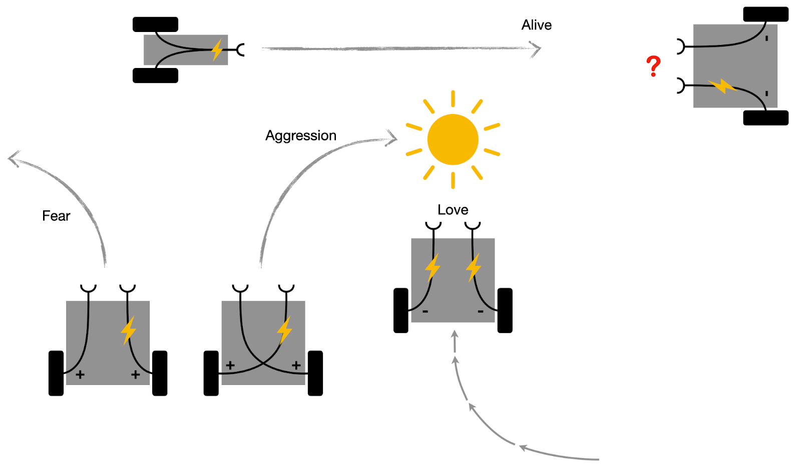

# A new course on Artificial Life
by [https://skriegman.github.io/](Sam Kriegman)

In this, my first year as assistant professor at Northwestern University, I am building out [https://www.xenobot.group/](my research group) and teaching my very first course: Artificial Life. The syllabus is available [https://docs.google.com/document/d/1jURIbvpQ0imcaMk-AHUmj_szZNtsA4lZAlcqXa6usXs/edit?usp=sharing](here). One-hundred-and-thirty extremely bright and creative students are now learning about the wonderful world of ALife for the very first time, and I get to stand in front of them each week as Morpheus with a firehose of red pills, feeding them all of the beautiful and inspiring work of this community, and watching their minds explode.

Because Northwestern is on a quarter system, I have the impossible task of covering the entirety of ALife in just nine weeks. And, as a new assistant professor, I have been flying by the seat of my pants. I am writing this to share my excitement and, also, to solicit comments, compliments and criticisms from the community. You can email me directly or share anonymous feedback through the form linked in the footer of the syllabus.

This new ALife class stands firmly on the shoulders of [https://www.reddit.com/r/ludobots/](Ludobots), a reddit-based MOOC that gently guides students, step by step, toward evolving possible brains (neural controllers) of a motile creature (kinematic tree) in a virtual world (rigid body simulation). After completing Ludobots, however, the students in this new course will be thrown straight into the deep end: they will be tasked with evolving not only brains but bodies too, and to do so without step-by-step instructions. I have no idea how this will turn out. We could end up with 130 populations of wiggling worms of varying lengths and sizes, without any real “march of progress” in terms of morphological and behavioral complexity. But I think this is unlikely. Did I mention how incredibly bright these students are? I made sure to warn the students that the assignments will suddenly become much more challenging midway through the course. What I have not told them (yet) is that they will be working on a problem that no one really has any idea how to solve. Who knows, maybe one of them will end up solving it.
