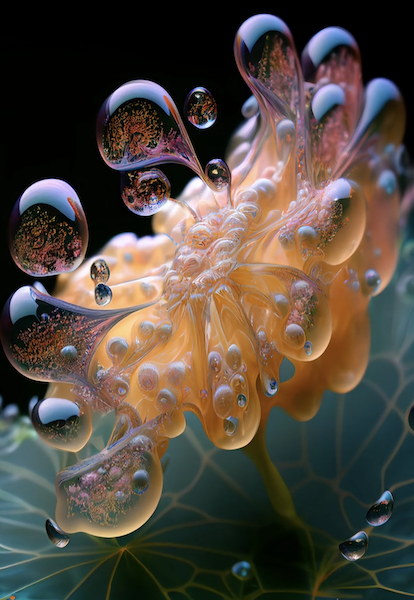

# Abiogenesis (artwork by Markos R. Kay)
shared by Lana

I found this video imagining the origins of life in oil droplets mesmerising and wanted to share it with the community. [https://www.mrkism.com/abiogenesis.html](The artist says): 

"Presented here is a conceptual reimagining of the "lipid world" theory which postulates that life originated from lipids forming membranes which would then envelop matter and nutrients to form protocells. Biological cells as we now know them can be thought of us membranes within membranes."
Watch the full video [https://www.mrkism.com/abiogenesis.html](here).
