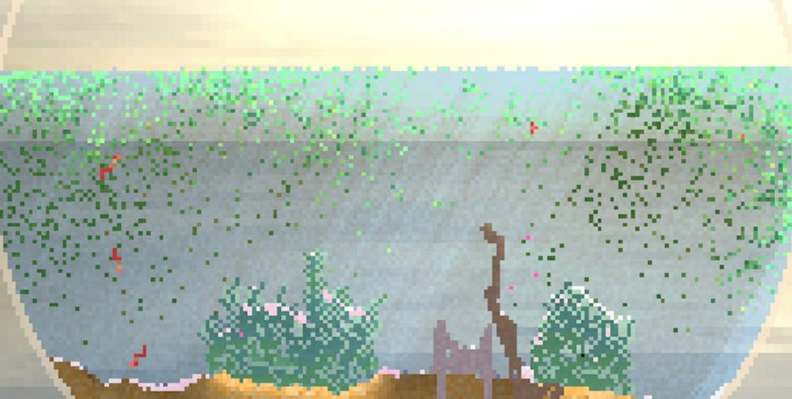

# Emergent Microcosms (a blog post by Samuel Arbesman)
shared by Lana

Sam Arbesman recently wrote a [vibrant Twitter thread](https://twitter.com/arbesman/status/1587456000856133633), full of videos and links to creative platforms, about the concept of "Emergent Microcosms". He ultimately released a long form version of his thought through his newsletter. Here is a short excerpt from the first paragraph, enjoy the whole post [here!](https://arbesman.substack.com/p/emergent-microcosms)

"In all the excitement around Large Language Models and other trendy aspects of Artificial Intelligence, I think that we’ve forgotten an under-appreciated group of computer programs: relatively small snippets of computer code that can generate complex and delightful virtual worlds. \[...\] Emergent microcosm is a fuzzy category, but it roughly spans biology and artificial life, complexity science, simulation, and creative coding." [Read Sam's post](https://arbesman.substack.com/p/emergent-microcosms)
