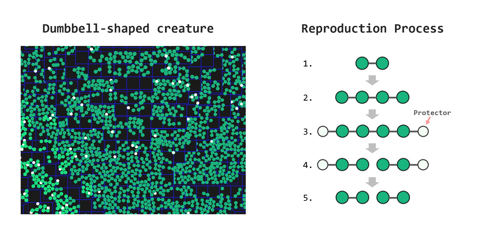
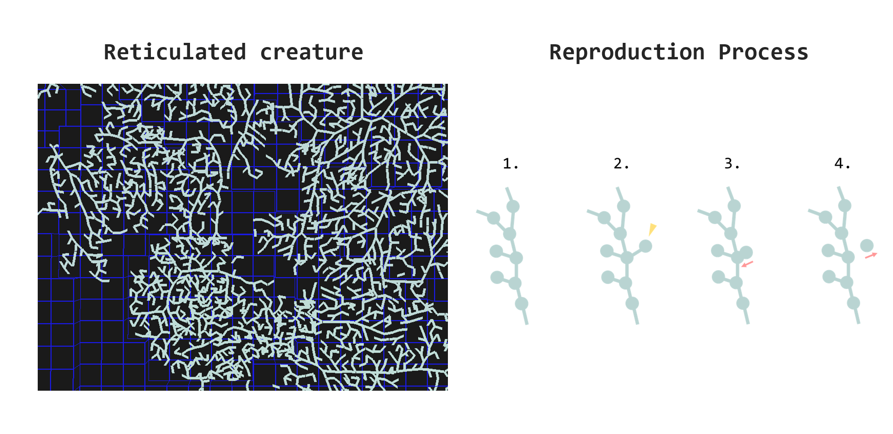

# ALife Game: OpenPraparat
By [Keishu Utimula](https://twitter.com/alife_praparat)

[OpenPraparat](https://github.com/A5size/OpenPraparat) is a code that simulates an artificial life model presented in the paper "[Artificial Life using a Book and Bookmarker](https://arxiv.org/abs/2210.12854)".  

This artificial life model is proposed with the aim of simulating reproduction, development, and individual interactions while providing high expressiveness for morphology and behavior. In this model, an artificial life body is constructed from spheres called cells and springs connecting them. Each cell has a Book as a gene and a Bookmarker that specifies the readout position of the Book. The artificial life body is formed by the cell expanding new cells and connecting around cells, according to the instructions in the Book. In addition, each cell has a neural network and can respond to external stimuli such as contact with other cells and photons. 

Currently, two types of creatures have been found in this model. One is a dumbbell-shaped creature, and the other is a reticulated creature.  

The dumbbell-shaped creature has a body where two cells are connected, literally shaped like dumbbells. This dumbbell-shaped creature multiplies by asexual reproduction, during which it deploys a white protective organ.  This is a trait they have acquired during evolution to make them less likely to be eaten by other creatures.  

The reticulated creatures are constructed by a large network of many interconnected cells. Its mode of reproduction is asexual, like that of the dumbbell-shaped creatures, but in the case of this reticulated creature, it has acquired the survival strategy of expanding its habitat by tearing off parts of its body and sending them flying far away.  

By installing this OpenPraparat, you will be able to simulate these creatures by yourself and also search for new ones!  

We eagerly await your reports of the discovery of new species of creatures!  
