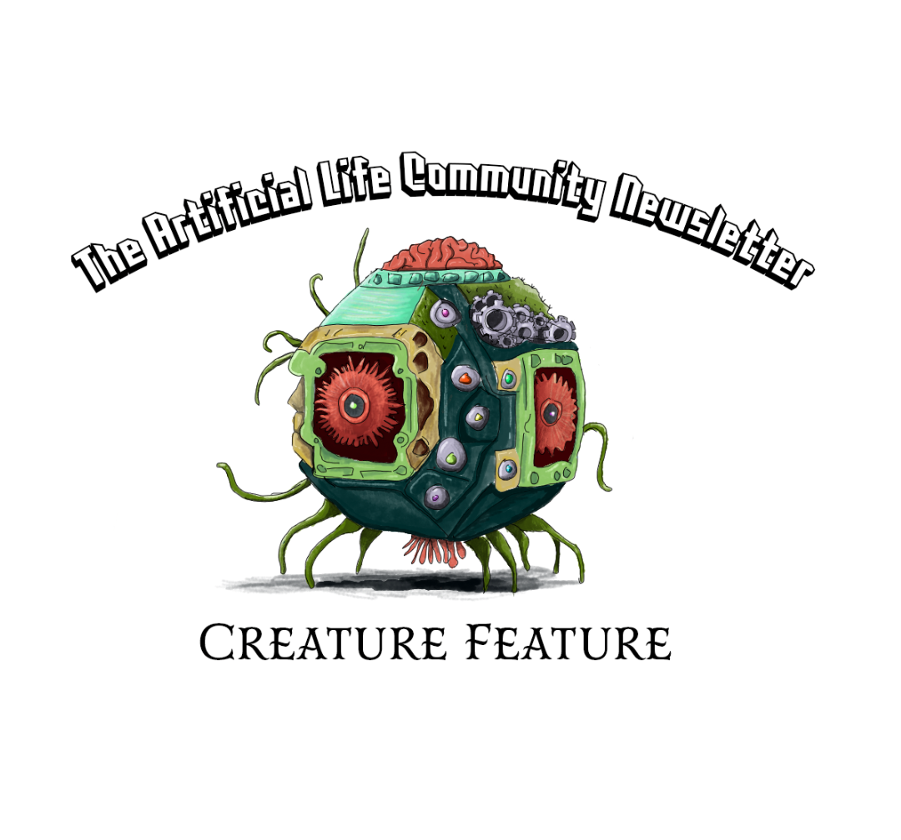

**Artificial Life Newsletter 011 -- Creature Feature!**

# A word from the team

Welcome to the 11th issue of the Alife Newsletter!

The theme for this issue is **creatures**, virtual creatures, real
creatures, fictional creatures. If it moves, we got it here!

Some of the amazing contributions to this edition include: a link to a
paper about an interface for people to play games with algae; a web
game that allows you to design a virtual creature with bones, muscle
tissue and brain controls; a review of a paper laying the basic ideas
of modelling life; and many other interesting tidbits!

Talking about creatures, we would like to welcome [Gabriel
Severino](https://twitter.com/GJSeverino), who has joined the team
with an amazing contribution: the banner that you see on top of this
edition!

If you'd like to contribute in any way to the newsletter: talking
about your project, boosting something that you like, or even just
giving suggestions about what we should cover next, please leave us a
message at [this form](https://forms.gle/jv7FdtdbWVTaTFGd9)! In
particular, we are specially interested in Master and PhD students who
want to talk about their own research ideas. Do send us a line!

If you'd like to receive our news, you can subscribe by e-mail
[here](https://forms.gle/QpQ68xhvSMt4wiv89), or by RSS
[here](https://alife-newsletter.github.io/Newsletter/RSS.xml).

Lana, Imy, Mitsuyoshi, Claus and Gabriel.
