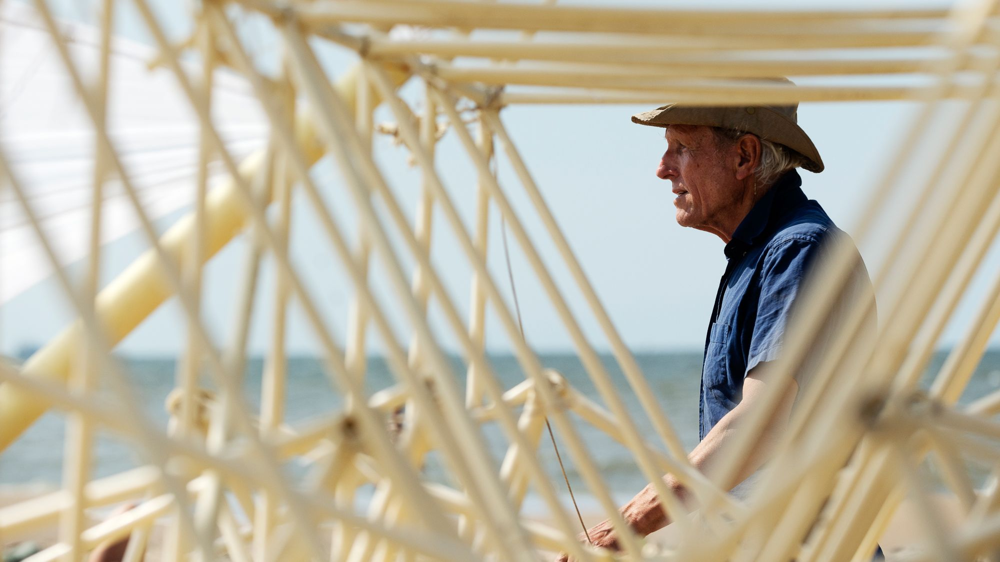
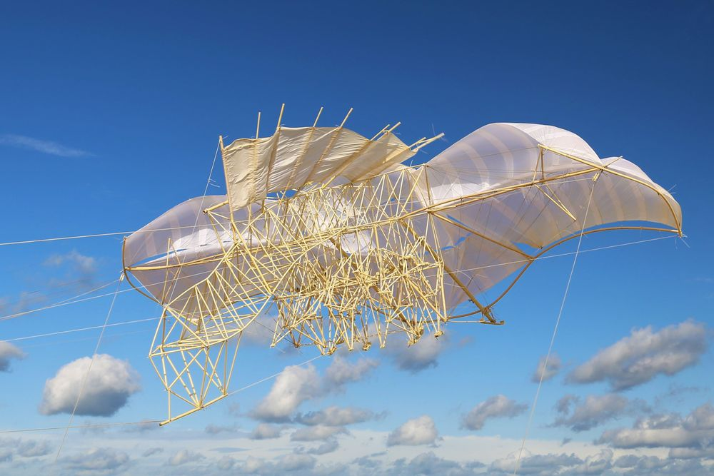

# Theo Jansen's Strandbeests
*Written by [Lana](https://lanasina.github.io/); images used with permission from [Theo Jansen](https://www.strandbeest.com/)

Theo Jansen in The Hague (© Theo Jansen)

For more than 30 years, artist Theo Jansen's artificial "beach animals" (strandbeests) have fascinated the world.
Every winter, Jansen builds a giant skeletal structure out of various materials. Many have sails, all have legs.
In the summer the new strandbeest is released on the beach of The Hague to walk all season, propelled only by wind.

A strandbeest walking (public domain)

Strandbeests are popular in the ALife community for their robust walking abilities on unstable terrain, achieved without brains or electricity; their evolution through the years, leading to a genealogical tree with innovations such as self-propelling or energy storage; and simply their fluid artistic beauty.

A flying strandbeest (© Theo Jansen)

Theo Jansen's interest does not stop at physical structures; [here](https://www.strandbeest.com/strandbeest/1989-vermiculusantramentum) he is programming self-reproducting worms in 1989!

You can keep up with new generations of strandbeests, book a beach viewing, or buy your own mini-strandbeest via Theo Jansen's website:
[https://strandbeest.com/](https://strandbeest.com/)
Many thanks to Mr Jansen for letting us share his wonderful pictures.
