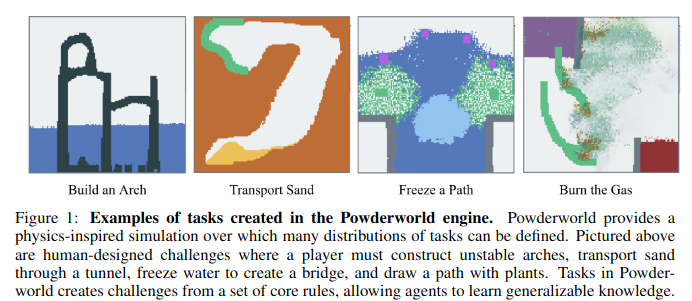

# Powder World Simulation for RL
*Write up by [Claus](https://scholar.social/@caranha)

[Falling Sand Games](https://en.wikipedia.org/wiki/Falling-sand_game)
always had a special place in my heart. In the original 2005 game, you
could mix elements like sand, water, fire and oil to produce all sorts
of amazing interactions. In that time, people quickly made derivatives
with increasingly more complex particle types.

Last year, [Kevin Frans](https://kvfrans.com) published an OpenAI Gym
compatible [RL environment that implements
PowderWorld](https://kvfrans.com/static/powder/), using GPU for fast
simulation. Agents can place or remove pixels from the world in order
to solve a variety of tasks, such as destroying the environment, or
moving particles to specific locations. A [paper overviewing the
environment](https://arxiv.org/abs/2211.13051) was published in ICRL
2023.

Beyond nostalgia, I think this environment could be a great tool to
explore concepts of open-endedness. I imagine searching initial states
for emergent/interesting systems would be a very cool task. 
