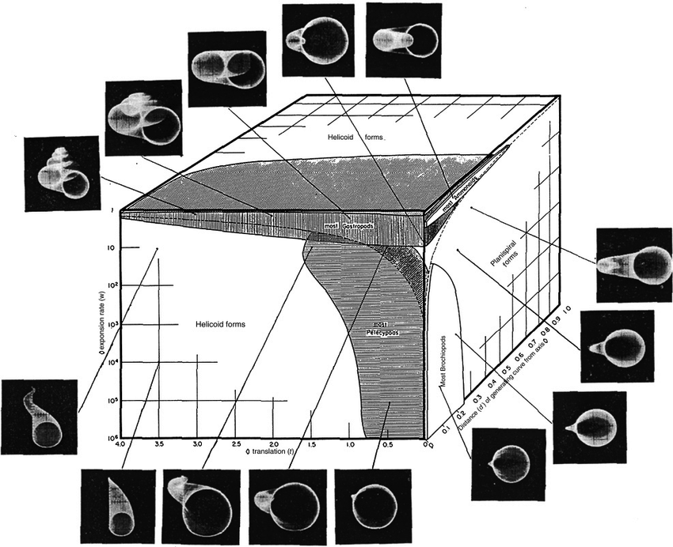

# Paper: Geometric Analysis of Shell Coiling: General Problems
*Written by [Gabe](https://twitter.com/GJSeverino)

Indeed, the beauty of nature is never as straightforward as it may seem. The way a flower blooms, the patterns of a snowflake, the symmetry of a butterfly’s wings. They are the outcomes of an elaborate balencing act of physical constraints and evolutionary pressures as intricate and layered as the most elaborate work of art. They are living manifestations of nature's own equations, found at the intersection of biology, physics, and mathematics. Yet, imagine if nature had chosen a different path. What if, instead of the reality we know, nature had painted with a different palette, a different set of mathematical equations? What if, instead of the snail shells and fish bodies we've become so farmiliar with, there were spirals and twists beyond our wildest imaginations? (Is this a Junji Ito story?!) These "what ifs" are the world of the morphospace – the canvas on which nature could have drawn, but didn't. Or perhaps, not yet!

But what is a morphospace? A morphospace is formalized mathematically as a point that represents a different morphology, or form. Where the axis of this space are typically a variable used to describe some physical characteristic of interest. So the closer to points are in morphospace, the more similar they would appear in form. Importantly, *not all* of the forms that can be seen within a morphospace are always found in nature, making themselves an interesting area of inquiery. It is a concept that allows us to visualize and explore the vast array of forms that biological organisms, such as shells, can take. The use of theoretical morphospaces was popularized by Paleontologist David M. Raup in a series of paper in the 1960s. Specifically, in his 1966 paper, "Geometric Analysis of Shell Coiling: General Problems," exploring the geometric parameters that govern shell coiling, such as the rate of whorl expansion (*W*), the translation rate (*T*), and the distance from the generating curve (*D*). These parameters are manipulated to generate a variety of shell forms, demonstrating the wide range of morphologies that can result from different combinations of these parameters. 

From the study of valve structure in brachiopods, fish body shape, to the work of understanding different possible network architectures when balancing small worldness and shortest path. Morphospaces have had a wide range of applications in the study of biological systems. Yet, one cannot help but wonder about the possibilities of morphospaces in line with "life as it could be". Many disciplines within Artificial Life involve the creation of artificial organisms, such as artificial neural networks, evolutionary robotics, and artificial chemistries often involves defining a space of possible forms or behaviors, much like a morphospace. Much like how a morphospace defines a space of possible biological forms, these disciplines often involve defining a theoretical space of possible artificial forms or behaviors.

By considering the possible configurations and behaviors of artificial organisms, scientists can better understand not only the potential of artificial life, but also gain insights into the constraints and possibilities that define biological life. In this way, the concept of morphospace serves as a valuable tool for both understanding the diversity of life as we know it, and imagining life as it could be.

If you're interested in reading more about morphospaces, you might want to check out the book [Theoretical Morphology: The Concept and Its Applications](https://www.cambridge.org/core/journals/short-courses-in-paleontology/article/abs/theoretical-morphology-the-concept-and-its-applications/B1FD474C1ECA2D0BEA20B23CF3C671E4) by George McGhee (Raup's own Graduate Student!). 

