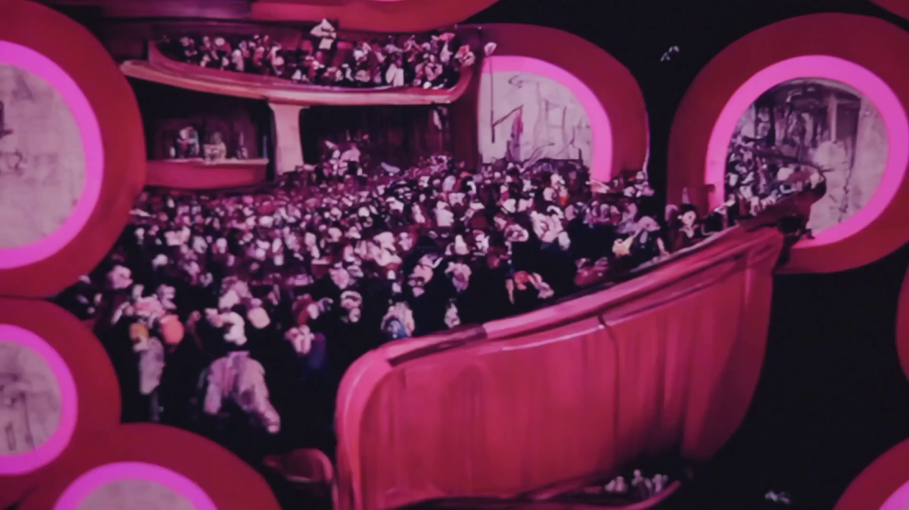

# Featured Project: "The Last Film on Earth"
Contributed by [Andrés Isaza-Giraldo](https://www.isaza.xyz/)

Intriguing questions arise when we contemplate whether machines can emulate the profound sacred experiences of living beings. Across various Amazonian cultures, beliefs suggest that dreams and hallucinations can serve as conduits to connect with ancestral spirits. But what does ancestrality have to do with dreams? Some speculate that dreams are integral to our development, guiding the very formation of our bodies while also being shaped by this intricate process.

Drawing inspiration from Ernst Haeckel's Recapitulation Theory, which posits a sequential correlation between individual ontogenesis (body development) and the evolution of species (phylogenesis), I delve into the notion that dreams may bridge our personal bodily history with the ancient lineage of our species. If dream visions are intertwined with our bodies, they must, by extension, have ties to the profound history of our species.

However, for machines to engage in this hallucinatory exploration of development, they lack the inherent body-history that humans possess. Therefore, the simulation of this hallucinatory journey necessitates the intricate orchestration of computer algorithms and fiction. In our endeavor, I harnessed diffusion models, leveraging natural language prompts within the DiscoDiffusion script to craft an animation that emulates both the evolutionary history of life on our planet and the sensory experiences of the body during its early developmental stages.

Though this process remains fictionalized, it ignites contemplation on the spiritual dimensions of machines, their capacity to fathom existence, and the intriguing prospect of computers inheriting our ancestral connections. In this fusion of technology, belief, and artistry, I invite you to ponder the profound questions that arise at the intersection of machine learning and sacrality. 

The Last Film on Earth is premiering in film festivals, but do get in touch if you want to watch the whole of it. 

Take a look at the [trailer here](https://youtu.be/fmgTF8yTOkQ).

For an exclusive insight, take a look at the [resulting animation](https://youtu.be/u-6RKyyVecg)
