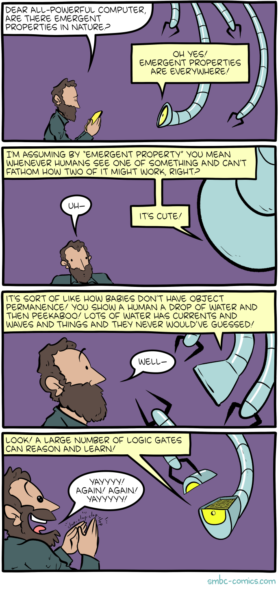

# Special Issue Review - Philosophical Transactions, Special Issue on Emergence
Spotted by Lana

There is a lot of talk about emergent properties recenty - and the reactions to this comic by [Zach Weinersmith](http://smbc-comics.com/comic/be) betray the general confusion about the topic.

Last year, the [Philosophical Transactions of the Royal Society published a whole issue on the topic: [‘Emergent phenomena in complex physical and socio-technical systems: from cells to societies’]([philosophical transactions of the royal society](https://royalsocietypublishing.org/toc/rsta/2022/380/2227)https://royalsocietypublishing.org/toc/rsta/2022/380/2227).
About half of them are Open Access, and there are ways to access the rest (thank you [captain Alexandra](https://gizmodo.com/sci-hub-pirate-elbakyan-receives-eff-award-1850686878)). Go have a look to learn about the origins of life, information theory, and pandemics.
