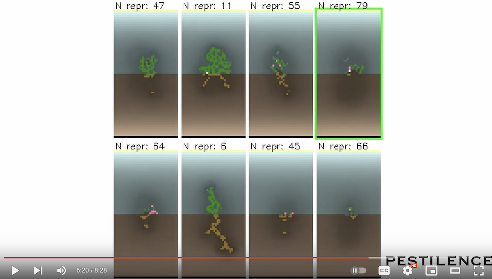
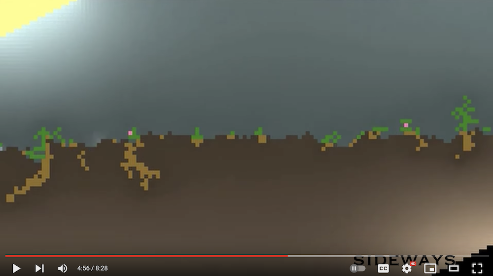

#  YouTube Channel: "Biomaker CA"
Spotted by Lana

Check out this new video about the Neural Cellular Automaton based biome, "Biomaker": [I Made Artificial Life Biomes Where Plants Grow, Compete and Reproduce! (Biomaker CA)](https://www.youtube.com/watch?v=iqsGs-1pbVI) 
It seems that the project by Ettore Randazzo now has its own dedicated YouTube Channel!

