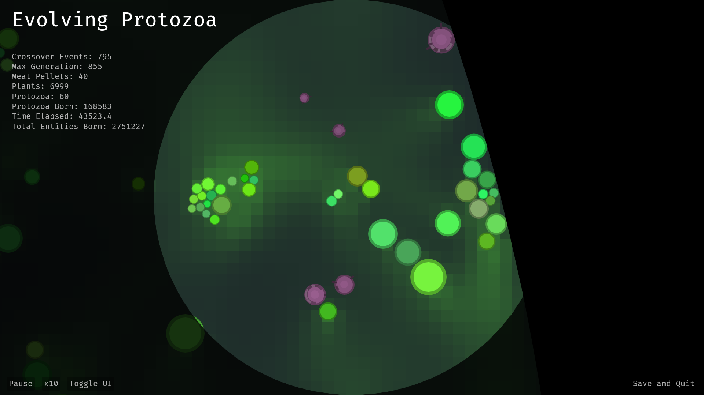

# Alife Simulation: Evolving-Protozoa

Evolving-Protozoa is a simulation of the evolution of single-celled organisms. Each single-celled organism metabolizes energy and consumes nutrients to grow. This simulation modelizes cell abilities and implements it to cellular organs. Each cell can have multiple organs, each of which has specific functions. These organs include spikes for attacking targets, legs for movement, sensors, adhesive substances, and more. Developing spikes can be used for hunting prey, sensors and legs for moving to more nutrient-rich locations, and adhesive substances for merging with neighboring single-celled organisms to form multicellular structures.

The specifications of each organism are determined by their genes, and thus, an evolutionary algorithm is implemented where individuals with superior survivability and reproductive capabilities are more likely to survive and thrive.

The simulation is implemented in Java and can be installed to run on your own PC. In the simulation app, the organs of organisms and pheromones diffusing in the environment are visualized, allowing you to admire the beautiful environments created by hundreds of various organisms.

[Evolving-Protozoa - GitHub](https://github.com/DylanCope/Evolving-Protozoa)  
[Real-time Evolution of Multicellularity with Artificial Gene Regulation - arxiv](https://arxiv.org/abs/2305.12249)  

