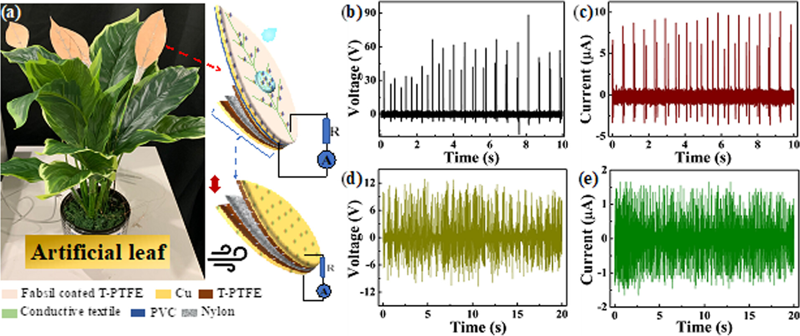

# Featured Paper: Artificial "Power Plants"
Spotted by Lana

I can't help it, I love projects that mix plants and robotics! How could I resist this recent paper about fake leaves that produce real energy?
The leaves are "multi-source energy harvesters": they produce electricity from both windpower and falling rain.

 

[Click here](https://pubs.acs.org/doi/suppl/10.1021/acssuschemeng.3c03620/suppl_file/sc3c03620_si_002.mp4) to see a LED array powered by the fall of one drop of water.
Is it practical? Will it ever be used in real life to inconspicuously power street lamps? Let's be honest, it is pretty rare for this type of device to end up mass produced. But every time that progress is made, we get closer to that reality.

Press: [Scitechdaily](https://scitechdaily.com/scientists-develop-literal-power-plants-that-harness-energy-from-wind-and-rain/)

Paper Ref: [Multisource Energy Harvester on Textile and Plants for Clean Energy Generation from Wind and Rainwater Droplets](https://pubs.acs.org/doi/10.1021/acssuschemeng.3c03620) by Guanbo Min, Gaurav Khandelwal, Abhishek Singh Dahiya, Shashank Mishra, Wei Tang and Ravinder Dahiya, 2 January 2024, ACS Sustainable Chemistry & Engineering.
