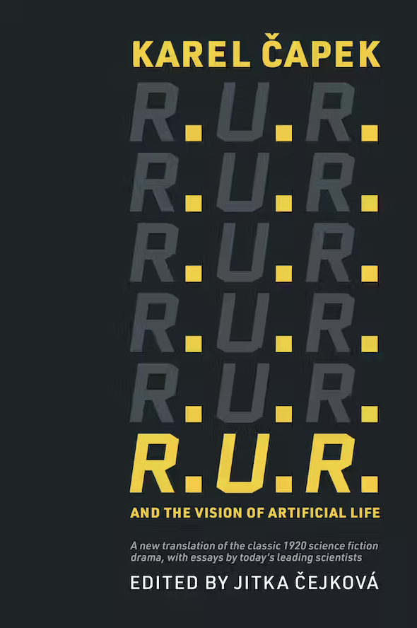

#  Book: "R.U.R. and the Vision of Artificial Life"
Shared by Lana

Did you know that the word "robot" is more than 100 years old? [This book](https://mitpress.mit.edu/9780262544504/ir-u-r-iand-the-vision-of-artificial-life/), an effort spearheaded by Jitka Čejková, presents a new English translation by translation by Štěpán Šimek of the Czech play "R.U.R: Rossum's Universal Robots" where Karel Čapek first coined the word. The play comes with 20 related essays by members of the ALife community. 

Blurb:

"Čapek's robots were autonomous beings, but biological, not mechanical, made of chemically synthesized soft matter resembling living tissue, like the synthetic humans in Blade Runner, Westworld, or Ex Machina. The contributors to the collection—scientists and other scholars—explore the legacy of the play and its connections to the current state of research in artificial life, or ALife. Throughout the book, it is impossible to ignore Čapek's prescience, as his century-old science fiction play raises contemporary questions with respect to robotics, synthetic biology, technology, artificial life, and artificial intelligence, anticipating many of the formidable challenges we face today."

Get your copy now! [MIT Press](https://mitpress.mit.edu/9780262544504/ir-u-r-iand-the-vision-of-artificial-life/)  [Amazon](https://www.amazon.com/R-U-R-Vision-Artificial-Karel-Capek/dp/0262544504/ref=sr_1_1)

