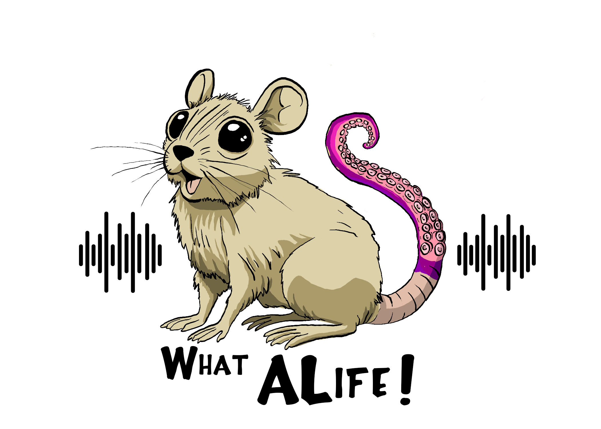

# WhatALife! Podcast
by [Imy Khan](www.imytk.co.uk)

...as if we needed any more podcasts in the world! But hey, I suppose we can't have too much ALife content, right? 

After much deliberation and procrastination, I finally organised myself to get the [WhatALife! Podcast](https://podcast.imytk.co.uk/) off the ground. The podcast aims (primarily) to serve as a sort-of outreach endeavour for Artificial Life as a field and community: breaking down some of the complexities of ALife topics, methods, and ongoing research, and making ALife more accessible to the masses. 

The podcast can be found on several streaming platforms ([Spotify](https://open.spotify.com/show/3u2WswlGc9tThXCYHonUGy), [Amazon Music](https://music.amazon.co.uk/podcasts/0ae1dcb0-6f2d-40ec-9e75-d9c938142ba3/what-alife-podcast?refMarker=null), [Google Podcasts](https://podcasts.google.com/feed/aHR0cHM6Ly9hbmNob3IuZm0vcy9mMjE5MzhjMC9wb2RjYXN0L3Jzcw)). I'm still working on getting it on to the remaining platforms (including Apple!).

RSS: [https://anchor.fm/s/f21938c0/podcast/rss](https://anchor.fm/s/f21938c0/podcast/rss).

At the time of writing, we are three episodes in - discussing cellular automata, theories of agency, and life as an early career researcher in the modern world - and we aim to have another episode out every few weeks. If you have any comments or suggestions for future episodes, or any feedback about the show, please send me an email at podcast@imytk.co.uk. If you would like to join me for a conversation on the podcast (or have suggestions for anyone who might be interested), please also feel free to write to me.

Artwork was created by our very own [Gabriel J. Severino!](http://twitter.com/GJSeverino)
