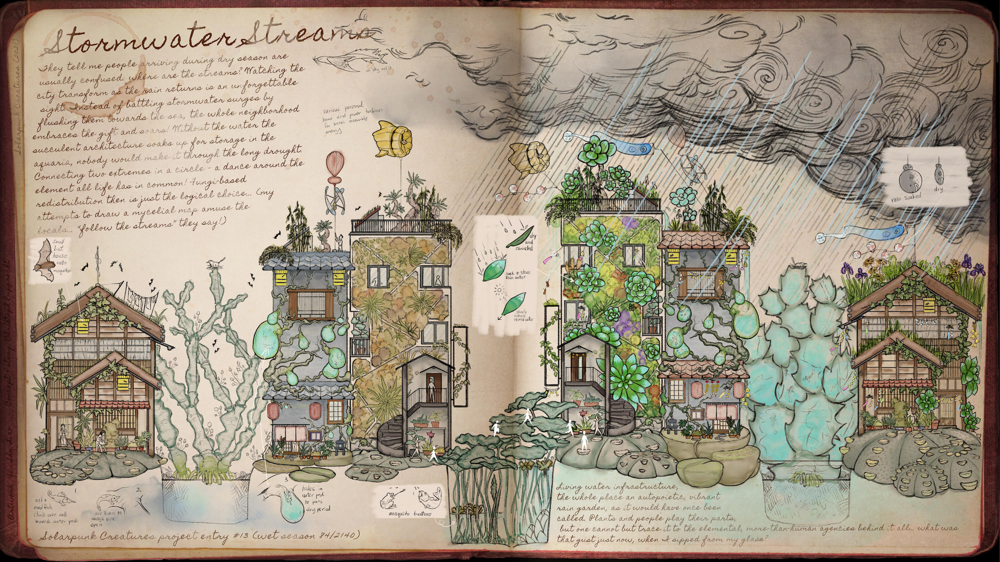

# Solarpunk: Nature and Tech
Shared by Lana Sinapayen

You may have come in contact with the idea of [Solarpunk](https://en.wikipedia.org/wiki/Solarpunk), through scifi books or video games, maybe even wihout realizing it!
Solarpunk envisions a future beyond capitalism, where humans use tech to live without overexploiting nature.
In this series of talks shared by the [Solarpunk Now!](https://spore.social/@solarpunkcast/111874256137288293) podcast, panelists from the [Solarpunk Conference](https://www.solarpunkconference.com/) share their visions of exiting capitalism and bringing solarpunk to the real world.

["From Capitalist Realism to a Solarpunk Reality: Building the Infrastructures of a Better Future" ](https://www.youtube.com/watch?v=rsu8hHtomtQ)

## Book: Speculative fiction anthology “Solarpunk Creatures"
[Christoph Rupprecht](https://multispecies.city)

What would coexisting with all forms of life be like? Three years have passed since our first anthology,  “Multispecies Cities: Solarpunk Urban Futures”, set out to tell stories of more-than-human urban coexistence and kinship.
Facing climate change, the sixth mass extinction, late-stage capitalism, and colonisation, yet refusing to surrender our entangled futures to despair, our contributing authors imagined worlds where people meet new allies of all shapes, sizes, and species.
Exploring these worlds left us to wonder: who are these new allies? What are their stories? What post-anthropocene futures might more-than-human senses discover?
Where “Multispecies Cities” sought to broaden the spotlight and highlight the multitude of actors on the stage, our next speculative fiction anthology “Solarpunk Creatures” introduces a whole new cast of more-than-human protagonists: organic and digital, alien and fantastic, tiny and boundlessly large.

Solarpunk Creatures features 20 stories and 8 artworks and is available since January 2024 [as an ebook](https://www.worldweaverpress.com/store/p187/Solarpunk_Creatures_%28ebook%29.html) or [paperback with color art](https://www.worldweaverpress.com/store/p186/Solarpunk_Creatures.html) directly from World Weaver Press or any bookshop.

![Main Text: They tell me people arriving during dry season are usually confused: where are the streams? Watching the city transform as the rain returns is an unforgettable sight. Instead of battling stormwater surges by flushing them towards the sea, the whole neighborhood embraces the gift and soars! Without the water the succulent architecture soaks up for storage in the aquaria, nobody would make it through the long drought. Connecting two extremes in a circle — a dance around the element all life has in common! Fungi-based redistribution then is just the logical choice… (my attempts to draw a mycelial map amuse the locals… “follow the streams” they say!)
Side Text: Living water infrastructure, the whole place an autopoietic, vibrant rain garden, as it would have once been called. Plants and people play their parts, but one cannot but trace it to the elemental, more-than-human agencies behind it all… what was that gust just now, when I sipped from my glass?”](images/sp01.jpg)

Cover art: [Paul Sommerfield](https://www.psummerfield.com/) 

Featured artwork: “Stormwater Streams (Connectedness)” (Art: [Yen Shu Liao](https://www.yenshuliao.com/), Text: [Christoph Rupprecht](https://multispecies.city)
