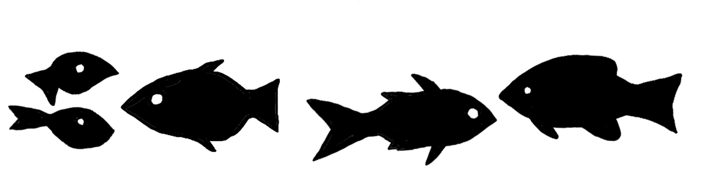
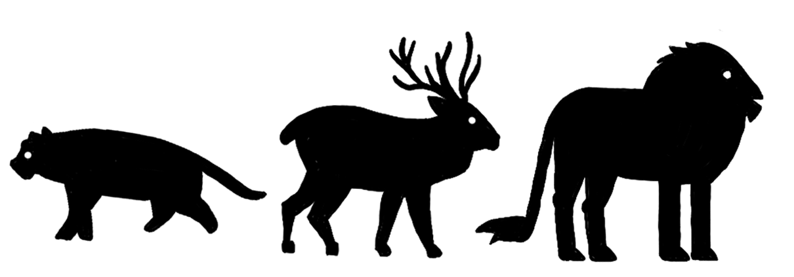
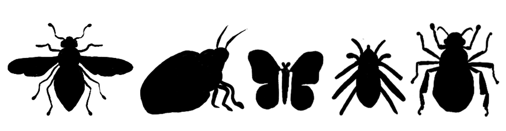
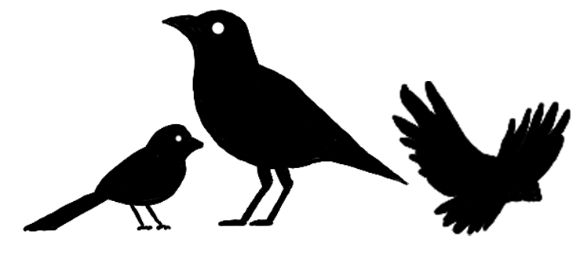

# Recommendations from the Team

Need something to read or do on your way home back from the conference? We got you covered, with a list of our favorite papers, books, entertainment and others! Load them up on your computer, and spend some quality time in the plane, or that weekend recovering from the conference. 

Note: For the physical newsletter, Gabe made some really nice illustrations for each subsection.

## Papers

- **Lana**: ["The Interface Theory of Perception"](https://sites.socsci.uci.edu/~ddhoff/interface.pdf), by D.D. Hoffman. The provocative idea that accurately perceiving reality can be evolutionarily detrimental!
- **Imy**: ["Artificial Life: Discipline or Method? Report on a Debate Held at ECAL '99"](https://doi.org/10.1162/106454600568375). The question in this paper is worth revisiting and reflecting on even 25 years later, as the breadth and depth of our work develops.
- **Claus**: ["The Surprising Creativity of Digital Evolution: A Collection of Anecdotes from the Evolutionary Computation and Artificial Life Research Communities"](https://arxiv.org/abs/1803.03453) (2020). An inspiring and fun survey of cases where evolution gave scientists what they wanted, but not what they needed.
- **Gabe**: ["Geometric Analysis of Shell Coiling: General Problems,"](https://www.jstor.org/stable/1301992) by Raup, D. M. (1966). One of my favorite papers of all time. Examines the space of possible forms for coiled shells using mathematical models in comparison with the shells that are found in real life.

## Books

- **Lana**: ["The Evolution of Beauty," by R. O. Prum (2017)](https://en.wikipedia.org/wiki/The_Evolution_of_Beauty). Examples of environmental fitness losing to mating fitness (aka beauty), without needing the handicap theory. This is your chance to hear about the Sexy Son Hypothesis...
- **Mitsuyoshi**: "Mortal Game", by Koichi Harukure. The only books I know that truly require artificial life (or cellular automata) are this one and Permutation City by G. Egan! In an interstellar exploration project, an organically emergent cellular automaton is discovered...
- **Imy**: ["Complexity Science: The Study of Emergence"](https://www.cambridge.org/fr/universitypress/subjects/physics/statistical-physics/complexity-science-study-emergence?format=HB&isbn=9781108834766) by Henrik Jeldtoft Jensen. A great in-depth introduction to the underlying principles of complexity and emergence across many scales. It offers lots of projects and questions within each chapter. My best book purchase of the year.
- **Claus**: ["Artificial Life: A Report of the Frontier From the Frontier where Computers meet Biology,"](https://dl.acm.org/doi/10.5555/529507) by Steven Levy (1993). A person-centric review of our field in its early days. It is fun to see what has changed, and what has stayed the same.
- **Gabe:** ["East of Eden"](https://en.wikipedia.org/wiki/East_of_Eden_(novel)) by John Steinbeck. A beautiful story spanning multiple generations. Wonderfully written characters, flawed and human in a way I’ve not often experienced in many other novels.

## Entertainment

- **Lana**: [The Dead Planets Society, podcast](https://www.newscientist.com/article-topic/dead-planets-society/). What if the Earth was a cube, if the moon had moons that had moons, if... applying real astronomy knowledge to unhinged scenarios.
- **Mitsuyoshi**: [Screeps](https://screeps.com/). A computer game where players deploy bots that autonomously play the game, managing resource metabolism and threats.
- **Imy**: [A series and a movie from the creator of Ghost in the Shell, Masamune Shirow: Appleseed](https://en.wikipedia.org/wiki/Appleseed_(2004_film)). Stories about genetic engineering, finding out the love of your life has become a cyborg, and just good ol' fashioned futuristic battles with AI overlords. Plus, the art style is beautiful!
- **Claus**: ["Children of Time,"](https://www.goodreads.com/book/show/25499718-children-of-time) by Adrian Tchaikovski (2015): A short sci-fi book about evolution. What else do I need to say? It is wonderful!
- **Gabe**: John Carpenter’s ``The Thing". My go to movie recommendation. It’s a classic 80s horror with awesome practical effects where you’re always trying to guess who the monster is. Bonus points if you watch it while it’s snowing outside.

## Wildcards

- **Lana**: Greg Egan, That's it. All his stories are great and more often than not, relevant to ALife!
- **Mitsuyoshi**: Tierra. This simulation exemplifies how simple rules can give rise to intricate ecological dynamics. - **Imy**: [Sean Carroll's Mindscape Podcast](https://www.preposterousuniverse.com/podcast/). Incredibly brilliant host who brings on a ton of interesting guests and scholars from many different disciplines.
- **Claus**: [Pico-8: A Fantasy Game Console](https://www.lexaloffle.com/pico-8.php). It can make not only games, but also cute simulations and it is a great tool for teaching programming. It is also super portable, and has a very friendly community.
- **Gabe**: Bent’s 2003 album The Everlasting Blink. Amazing album with jazzy samples and the perfect soundtrack for taking a long walk.