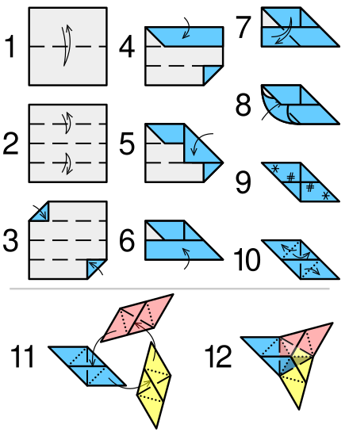

# Sonobe, Modular Origami

Sonobe is an Origami fold that can be joined with other copies of itself to make complex shapes. The physical edition in ALIFE 2024 included an origami paper piece that you could fold and join with the pieces folded by other alifers. But you can still create your own modular origami following the links below!

*Sonobe folding instructions image by Cmglee, CC BY-SA 4.0, via Wikimedia Commons)

Follow the instructions in the image above to fold the basic module (steps 1-10). Then you can assemble a pyramid with three modules (steps 11-12). [Find ideas for more complex assemblies in this link](https://momath.org/mathmonday/math-monday-12-card-star-puzzle/math-monday-introducing-the-sonobe-unit/)
