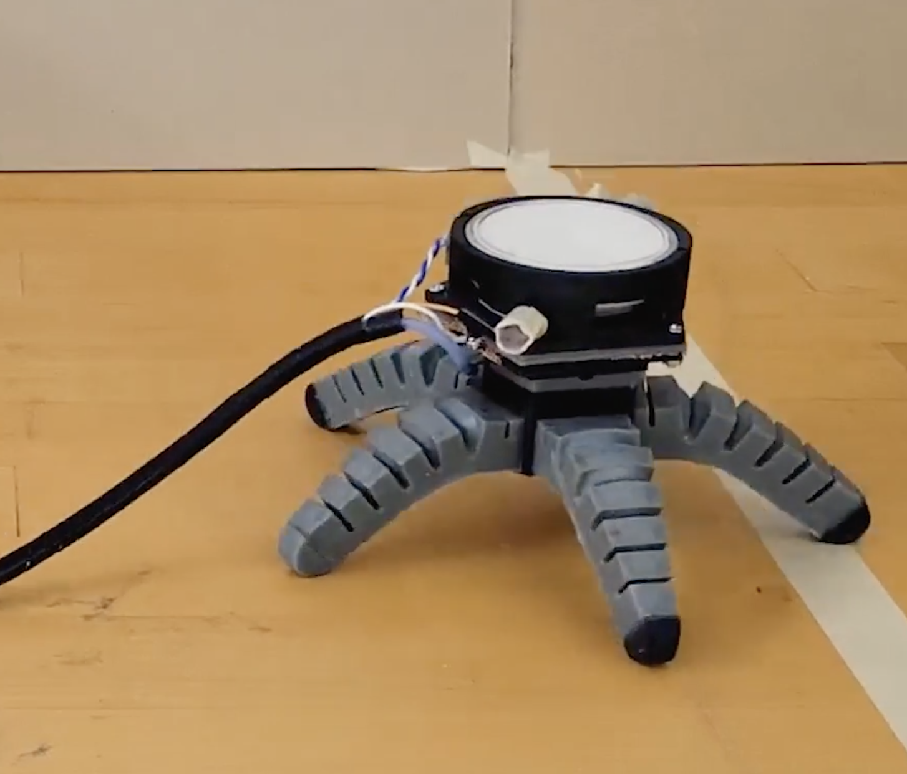

# An Oyster Mushroom for a Brain

"By growing mycelium into the electronics of a robot, we were able to allow the biohybrid machine to sense and respond to the environment" [source: Cornell University press release](https://news.cornell.edu/stories/2024/08/biohybrid-robots-controlled-electrical-impulses-mushrooms)

 

In this research, the mushroom's mycelium (hair-thin root-like organs) acts as both a sensor and a controller for a pair of robots. We've seen plant-robot and slime mold-robot integrations before, but oyster mushroom is a first!

(Paywalled) Mishra, Anand Kumar, et al. "Sensorimotor control of robots mediated by electrophysiological measurements of fungal mycelia." Science Robotics 9.93 (2024): eadk8019.
