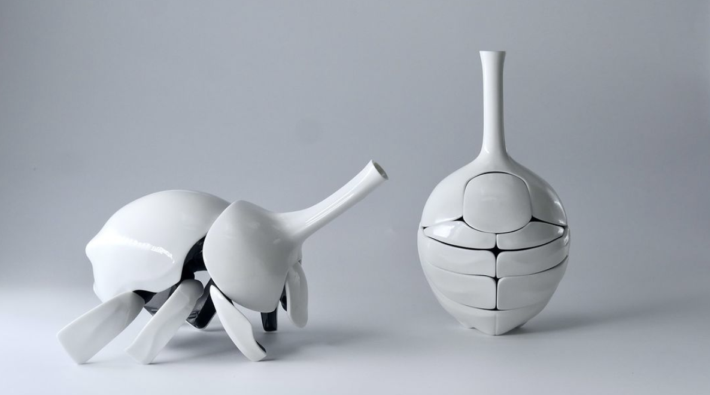
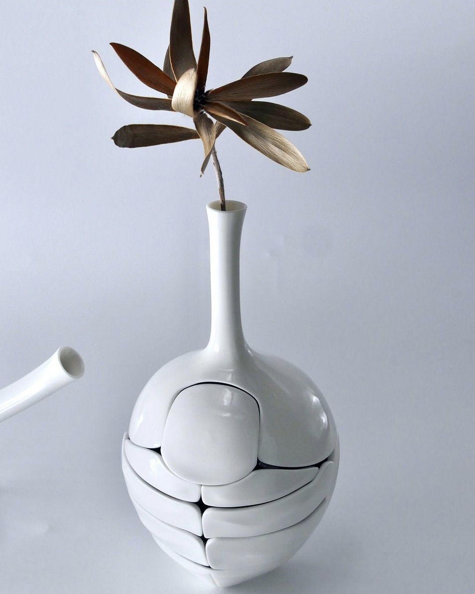

# Domestic Camouflage
Shared by Lana

I came across this gorgeous ceramic art by [Hori Takaharu](http://utsuwamushi.com/), who focuses on insect-like forms camouflaging themselves as household objects.
For my birthday, please send me a [kintsugi scarab teapot](https://utsuwamushi.com/1397/), thank you in advance.

Takaharu graciously allowed us to share pictures with our readers, but you can also find him on [Instagram!](https://www.instagram.com/ceramic_hori/)

 
