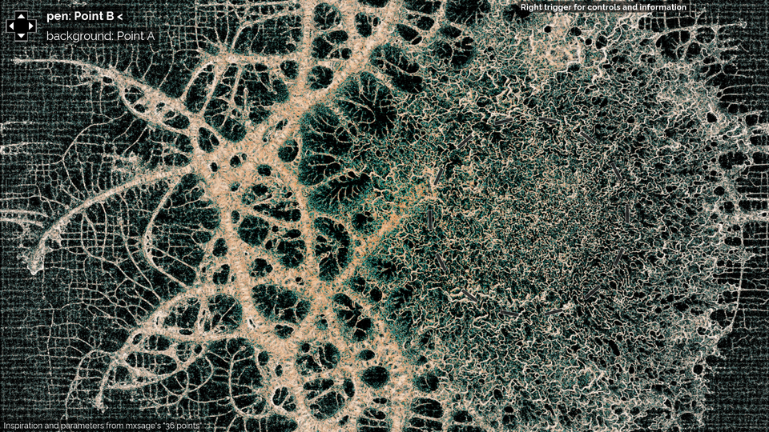

# Interactive Physarum
shared by Lana

You may have seen Slim Mold simulations before, but have you seen many *interactive* slime mold simulations?
"[Interactive physarum](https://github.com/Bleuje/interactive-physarum)" by user Bleuje (Etienne Jacob) on github is an interactive exploration of the parameter space leading to slime-mold-like patterns. This work is based on the work of [Sage Jenson](http://cargocollective.com/sagejenson/physarum).
Go visit Etienne Jacob's project to see beautiful screenshots and run the simulation, or watch the demo video [here](https://www.youtube.com/watch?v=4hLtjlaVzsk).
In fact, go have a look at [the entire channel](https://www.youtube.com/@bleuje), you won't regret it!

Image credit: Etienne Jacob

