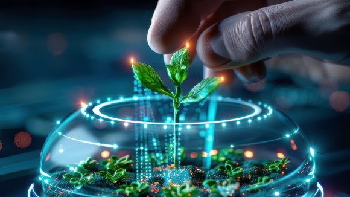

# Call For Papers: Unnatural Histories: Investigating the Improbable with Experimental Evolution and Artificial Life
Shared by Lana

[NPJ Complexity](https://www.nature.com/npjcomplex) is launching a special collection on Artificial Life. Submission deadline: September 2025!

"[Unnatural Histories: Investigating the Improbable with Experimental Evolution and Artificial Life](https://www.nature.com/collections/hahjddiich)"

The study of life has traditionally focused on documenting and understanding what exists and what has existed — the actual rather than the possible. However, as François Jacob astutely observed, our scientific understanding is inherently shaped by the limitations of our collective imagination. It is only through confronting the vast landscape of what *could be* with what actually *is* that we begin to comprehend the fundamental principles governing living systems.

By leveraging modern tools from Experimental Evolution, Synthetic Biology, and Artificial Life, researchers can now empirically investigate paths not taken by natural evolution and gain concrete experimental insights rather than being limited to theoretical speculation. In this spirit, npj Complexity is launching a special collection on "Unnatural Histories". This collection will showcase research that goes beyond conventional natural history to examine alternative biological worlds and unexplored evolutionary trajectories.

