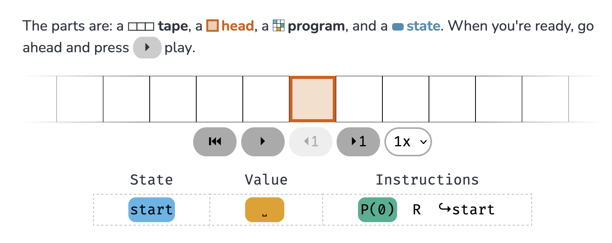

# A Web Introduction to the Turing Machine
shared by Lana

**Webpage: [https://samwho.dev/turing-machines/](https://samwho.dev/turing-machines/)**

One of the most famous concepts in computer science is the concept of the "Turing machine" and its exciting associate, "Turing completeness". The [Game of Life](http://game-of-life.daneaiulian.com/index.php) is Turing complete! DNA is a Turing machine! Biology and computers brought together, a topic of interest to ALifers since the beginnings of the field. But wait, what does any of this mean, and why do people get excited about it? Whether you learned about it in school and need a refresher, have never really known what it is and how it relates to Alan Turing, or know exactly what it means and would like to have fun with beautiful, interactive animations, this website is for you. As stated in the introduction,

> "By the end of this post, you will know:

> - What a Turing Machine is.
> - What can and cannot be computed.
> - What it means to be Turing complete.
> - How modern computers relate to Turing machines.
> - How to write and run your own programs for a Turing machine."

