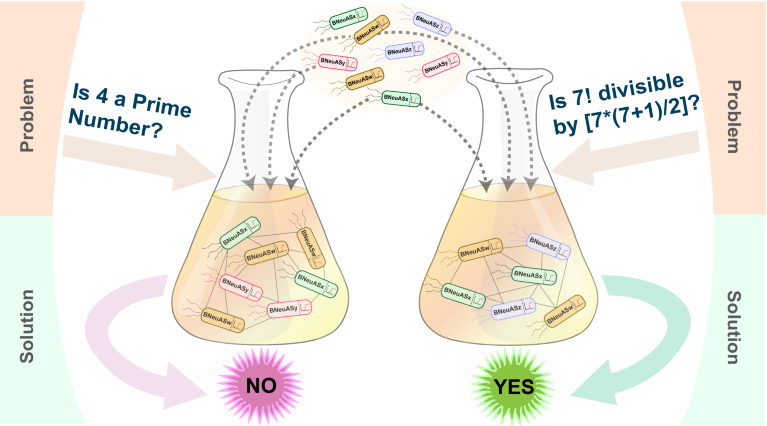

# Bacotneurons

Shared by Lana

Graphical abstract by Sangram Bagh

You may have heard of using computers to simulate bacteria, but have you heard of using bacteria to perform computations?
That is what a team at the Saha Institute of Nuclear Physics (!) in India did in this paper: https://www.nature.com/articles/d44151-024-00175-8.

They created different types of e. coli so that each type could be used to perform one type of computation, and used those bacterial cells to emulate a computational neural network. Chemicals are used as inputs to the network, and the output is read as proteins created by the bacteria. The team managed to solve tasks such as asking whether a small number is prime or not! All hail the bactoneurons.

