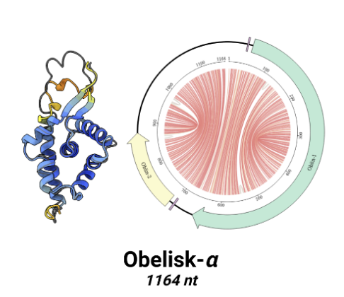

# Obelisks: A new class in the tree of life

Shared by Lana

**Preprint: [Biorxiv](https://www.biorxiv.org/content/10.1101/2024.01.20.576352v1)**

**Pop-sci writeup: [Science alert](https://www.sciencealert.com/obelisks-entirely-new-class-of-life-has-been-found-in-the-human-digestive-system)**

An analysis of Obelisk Alpha, one of the types of obelisks discovered by the team. Credit: Ivan N. Zheludev, Robert C. Edgar, Maria Jose Lopez-Galiano, Marcos de la Peña, Artem Babaian, Ami S. Bhatt, Andrew Z. Fire

In a preprint published last year, scientists announced that they had found RNA-based elements that, despite having a lot in common with viruses, do not have a protective coating: their RNA is just rolled in a the shape of a rod and exposed to the outside world. This makes them an entirely new class of life, right next to viruses and bacteria. The researchers named these rods of RNA "obelisks".
While it is unclear what obelisks actually do, they seem to be very numerous and can be found inside the human gut: obelisks were detected in up to 10% of the data analyzed by the research team. Even more striking, once they knew what to look for, the researchers found evidence of obelisk RNA in existing public datsets.
What other classes of life could we be missing? And could ALife simulations point out these gaps in our understanding of the tree of life?
