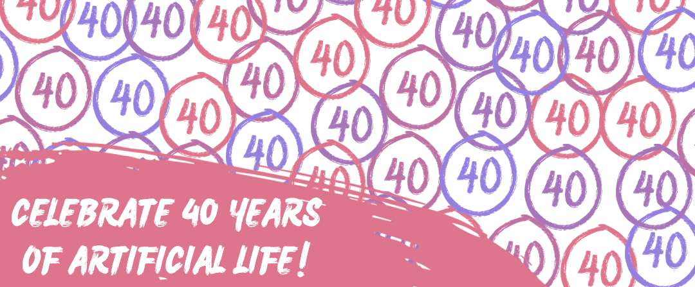

# 40 Years of Artificial Life Conferences

By Jitka Cejkova

The first Interdisciplinary Workshop on the Synthesis and Simulation of Living Systems took place in September 1987. The 40th anniversary of the artificial life conference series is approaching! In honor of this milestone, I am planning to prepare a book and would greatly appreciate your help in gathering materials to support its creation or to celebrate the anniversary in another way.

To begin, I would like to ask for your cooperation in identifying which ALIFE or ECAL conferences you attended. If you could kindly mark the relevant conferences in this first simple form, that would be incredibly helpful.

I would also welcome any materials and notes you might have related to these conferences. For this purpose, I’ve prepared this second form. If you could scan or photograph any relevant materials (printed materials, programs, posters, badges, conference gifts, etc.), I would greatly appreciate it. The older, the better! Additionally, your personal stories and memories related to the artificial life community would be of great interest to me. This could include personal anecdotes, key scientific moments, stories about key figures (whether they are still with us or have sadly passed), as well as your overall impressions, experiences, or any memories related to the artificial life field and past conferences.

I would be especially grateful to hear from those of you who are ALIFE "veterans," including organizers or participants from previous years who might be willing to answer follow-up questions.

I would also appreciate it if you could share this call for contribution with your ALIFE colleagues, including retired members or those who were once actively involved in the conferences.

Thank you!

Jitka Čejková

(Education and Outreach Chair of The International Society for Artificial Life)

email: robot100.cz@gmail.com 
