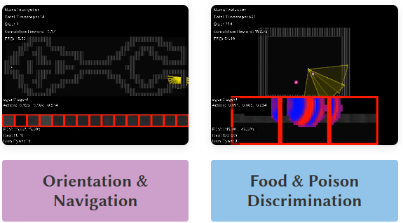
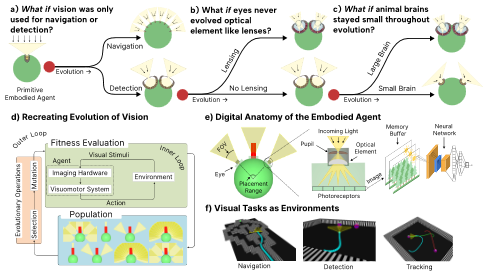

# Simulation Project: "What if Eye?"

*Summary by Claus*

The MIT Media Lab, Camera Culture group, has recently published a project called ["What if Eye?"](https://eyes.mit.edu/). This project aims to computationally simulate the evolution of visual systems, from early light sensors to fully fledged lensed eyes.

The simulation occurs in virtual creatures who have to solve tasks in a 2D environment using visual input. Evolution controls both the physical characteristics of these eyes (number of eyes, lensing, etc), as well as the neural network that reads and processes the signals produced by them. 

The project's webpage has links to both the [paper describing the simulation and evolutionary framework](https://arxiv.org/pdf/2501.15001), as well as a [link to the simulation software on github](https://github.com/cambrian-org/ACI). 
