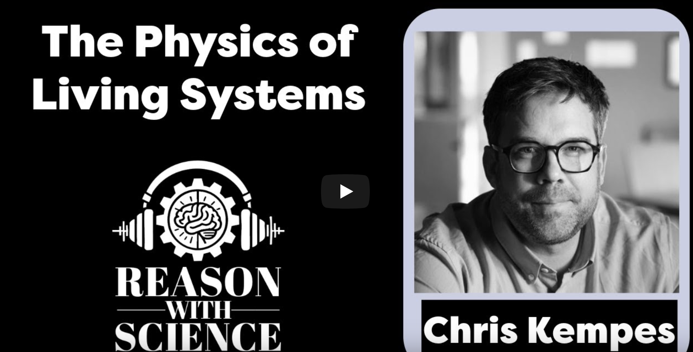
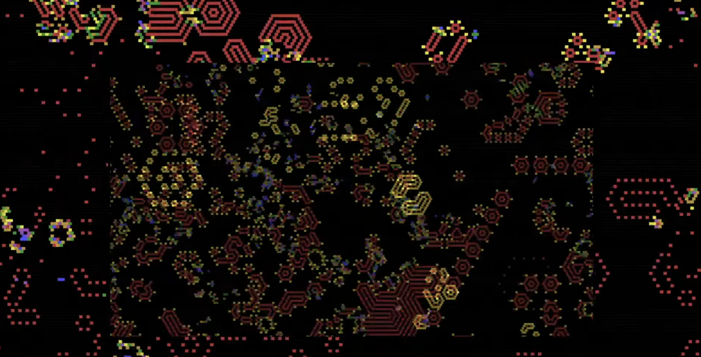
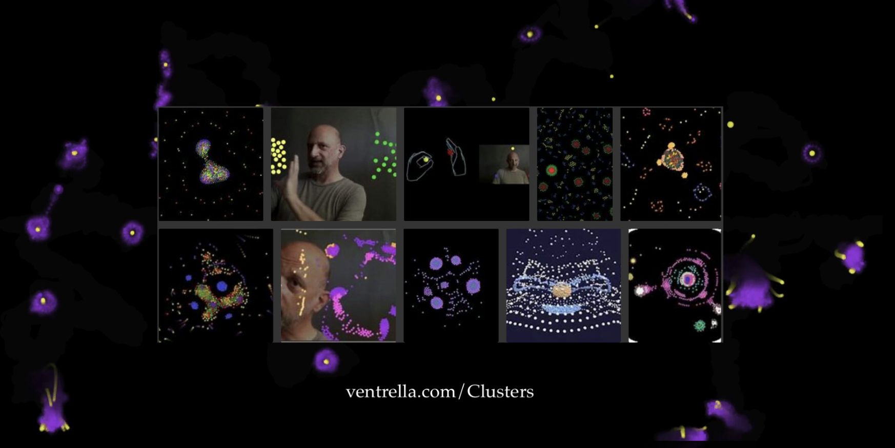
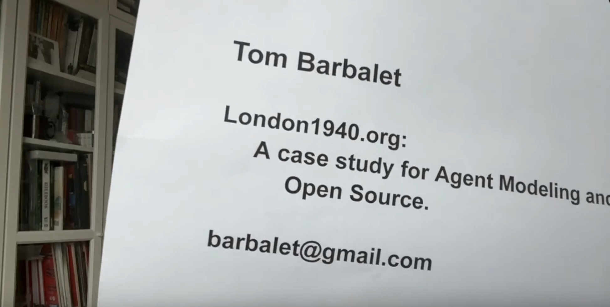
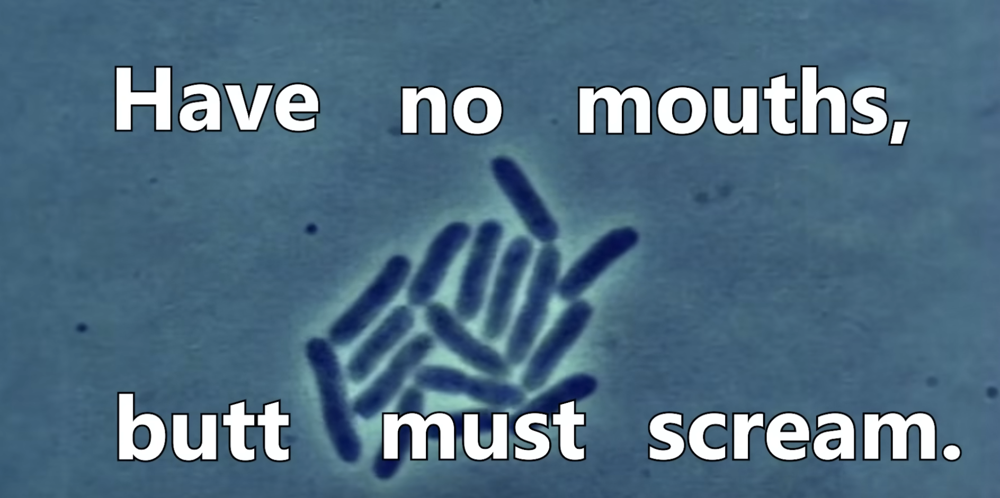
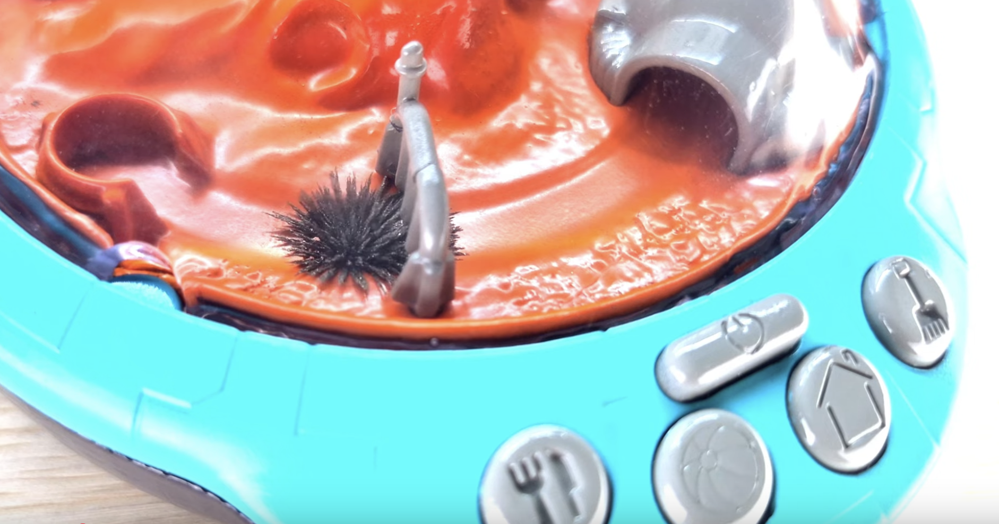
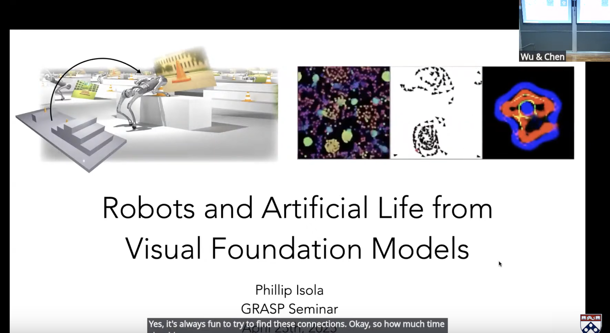
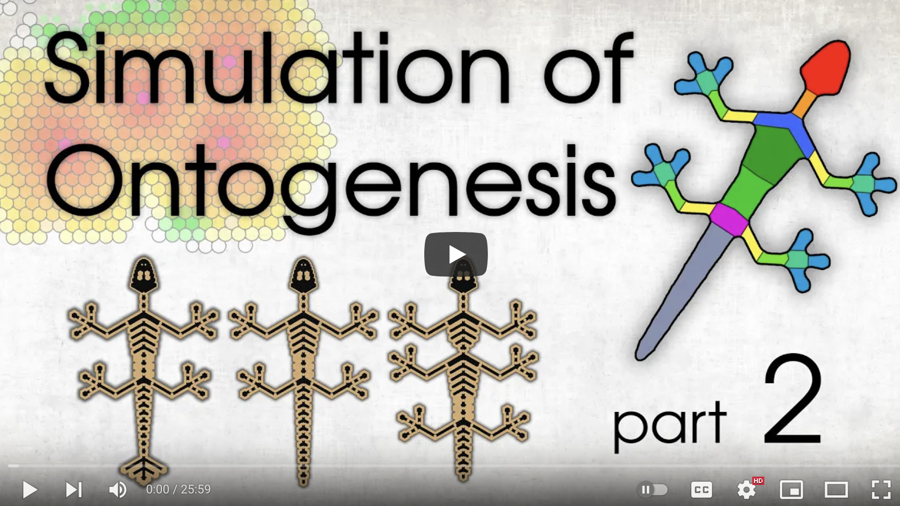

# ALife Videos
Shared by Lana

In this edition we have collected quite a few interesting videos, here they all are for your viewing pleasure!

"The Physics of Living Systems" with Chris Kempes for "Reason with Science" 

"This episode is with Chris Kempes, a professor at the Santa Fe Institute, working at the fascinating intersection of physics and biology. Chris joins us to talk about some of the most profound questions about life starting from fundamental definitions to exploring life's potential multiple origins guided by the laws of physics. Join us as we explore the role of energy landscapes in Prebiotic chemistry, the physical basis of microbial behaviors, scaling laws that govern life's metabolic patterns, and how collective behaviors emerge in multicellular organisms. Let's embark on a journey to rethink life's mysteries through the lens of physics."

[https://www.youtube.com/watch?v=2rvJoa31-KI](https://www.youtube.com/watch?v=2rvJoa31-KI)

"Hypercycle – Let There Be Artificial Life" by Jeffrey Ventrella and Jean-Claude Heudin

"A collaboration between visual artist and Artificial Life researcher Jeffrey Ventrella and AI researcher and composer Jean-Claude Heudin. Both the video and the music are created using bio-inspired algorithms showing the emergence of life-like forms."
The entry after this one is also by Jeffrey Ventrella!

[https://youtu.be/nMuyJQ0GXSk](https://youtu.be/nMuyJQ0GXSk) 

"Clusters - an Asymmetrifcal Particle System with Emergent Patterns" by Jeffrey Ventrella

"This is a video explaining the Clusters particle algorithm. Explore it in real-time at ventrella.com/clusters"

[https://vimeo.com/1048238799](https://vimeo.com/1048238799)

"London 1940" by ‪Tom Barbalet

"Tom talks about his London1940.org simulation project that really needs a particular kind of developer to pick it up."

[https://www.youtube.com/watch?v=pD-PNwk-Z9E](https://www.youtube.com/watch?v=pD-PNwk-Z9E)

"Rewriting DNA to make custom monstrosities" by The Thought Emporium
 

"In this video we take a deep dive into the world of genetic engineering. What is it, what's it's history, how does it work, and how you can do it too! We explore a variety of custom printer pieces of DNA, and see all the amazing things they do when you put them into a living organism. We've got things that glow, smell, and even things that behave like electrical circuits and transistors."

[https://www.youtube.com/watch?v=10OUPyamn1w](https://www.youtube.com/watch?v=10OUPyamn1w)

"Dear Humans: Meet Ferro Pets!"

A video showcasing a clever use of ferromagnetic sand and "lifelike" behavior.

[https://www.youtube.com/watch?v=koN1SnLldGU](https://www.youtube.com/watch?v=koN1SnLldGU)

 “Robots and Artificial Life from Visual Foundation Models”, a talk by Phillip Isola (MIT) for Spring 2025 GRASP on Robotics.

ABSTRACT
"I will talk about two ways we can design agents with the help of powerful vision/graphics models. In the first project, LucidSim, we augment a traditional robotics simulation engine (MuJoCo) with visual detail from an image generative model. The generator adds diversity and realism to the barebones MuJoCo content, and results in a RGB-only policy trained entirely in sim that generalizes zero-shot to the real world. In the second project, ASAL, we use a visual recognition model to search for artificial lifeforms that display distinct and interesting behaviors. This process can discover cellular automata that are open-ended like Conway’s Game of Life, particle swarms that flock like Boids, and more."

[https://www.youtube.com/live/MywO2yL4b68](https://www.youtube.com/live/MywO2yL4b68)

"Simulation of Ontogenesis"

Simulife Hub is a youtube channel with many simulations of tenets of Artificial Life, from plant generation to the evolution of altruism. Here is their latest video, about multicellularity.

"All cells have the same genome, but each cell must perform tasks according to its position in the growing organism.
To do this, cells must somehow interact with each other and regulate the expression of their genes.
This project is dedicated to exploring this process.
I'm not a biologist. While delving into this topic,
I'm trying to model these processes on a computer and create videos based on the results of my experiments."

[https://www.youtube.com/watch?v=qwJNeq-WABU](https://www.youtube.com/watch?v=qwJNeq-WABU)

