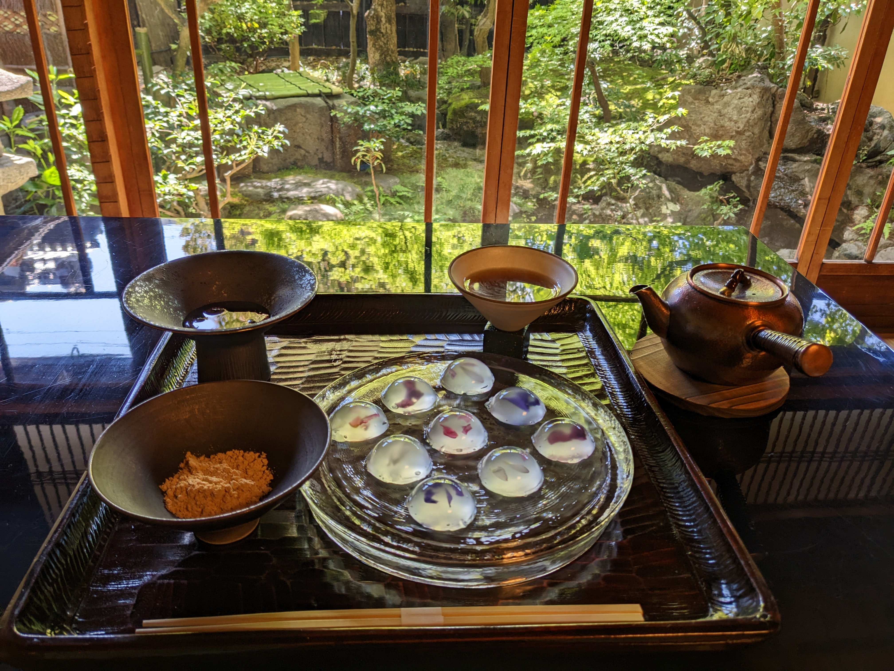
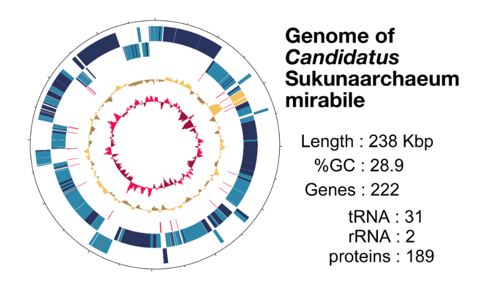

# The ALIFE Newsletter Survey

In July we held a survey to learn more about who reads the Artificial Life Newsletter, and how we can improve it. Thank you all who answered our survey! 

In the next edition, we will go in details about what we've learned from your answers. In the meantime, there is a teaser below. If you haven't participated yet, you can still [fill the newsletter survey questionnaire](https://docs.google.com/forms/d/e/1FAIpQLSefnAyyxWYtOlAKTnaB9w8wyHPro9BoOuB_f_ZPOrz-0VLOrw/viewform?usp=sharing).

## Who reads the Artificial Life Newsletter?

# (Kinda) ALife related things in Kyoto

(**NOTE**: some locations have no English support. Check before you go)

## Tech and Nature

- [Team Lab Interactive Art Museum](https://www.teamlab.art/e/kyoto/)
- [Night light up, botanical gardens](https://www.lightcycles-kyoto.com/)
- [Light up around the Kyoto Aquarium](https://www.kyoto-aquarium.com/news/details/6965.html)

## Art Art

- The Osaka Expo (in Osaka) has exhibits by members of the ALife community!
- [Yokai (Japanese Monsters) festival at Toei Studio Park](https://www.toei-eigamura.com/yokai/)
- [Art Rhizome Kyoto](https://artrhizome.kyoto/)

## Nature-themed Sweets

- [Edible flower bouquet in an ice cream cone (sweet bean paste)](https://thisis.website/shizen/)
- ["Fish in a pond" shaved ice](https://maps.app.goo.gl/vnrhnM4xi7uGrcmu9)
- [Flowers in transparent bracken jelly, in a historical house and garden](http://rokujuan.com/)

# The Laziest Life Form Ever? This Microbe Ditched Almost Everything and Still Survives

Researchers have discovered a microorganism so metabolically stripped-down, it might be right on the edge of what we would consider to be "alive".

Meet *Sukunaarchaeum mirabile* (named after a tiny Japanese deity), a microscopic hitchhiker that's taken the art of being lazy to the extreme. 

The tiny archeon has ditched almost everything most life forms need to survive: it can't make its own food, can't process energy, can't even handle basic cellular housekeeping. Instead, it freeloads off a marine dinoflagellate, keeping only the bare minimum needed to copy itself: DNA replication and protein-making machinery. Its genome is absolutely tiny, at just 238 kilobases (1 kb = 1000 base pairs of DNA/RNA), making it the smallest archaeal genome ever found (less than half the size of the previous record holder)! 

This is clearly an interesting discovery for ALifers since it blurs the boundaries between (living) cellular organisms and (non-living) viruses. *Sukunaarchaeum* has retained the core cellular machinery that viruses typically lack, yet its extreme host dependence and specialisation for pure genetic self-replication mirrors viral strategies. It provides a real-life example of how a biological system can be pared down to its most essential components, living a virus-like existence while still maintaining a "cellular" identity. It raises interesting questions about what we'd need to include in truly minimal artificial life forms.

- Paper: ["A Cellular Entity Retaining only its Replicative Core: Hidden Archeal Lineage with an Ultra-reduced Genome"](https://doi.org/10.1101/2025.05.02.651781)

# Origami Robots

When you hear the word origami, you might think of folded paper. But did you know that robots can form from origami too? It’s true.

It is actually possible to create robots that start out as flat sheets, then fold themselves into three-dimensional agents that can crawl like caterpillars, wriggle like earthworms, and even swim like fish. In some cases, a single sheet can generate an entire swarm of origami robots.

So how does this work? (After all, paper doesn’t fold itself.) For these robots, smart materials are embedded in flat sheets. When activated by heat or electrical signals, the smart materials help the sheet fold along predetermined crease patterns, just as you might follow an origami pattern to turn a simple square of paper into an elegant paper crane.

To form a swarm, the material is designed to separate instead of folding, similar to kirigami (where paper is both cut and folded). After the agents separate themselves from the sheet, they fold themselves into their final shapes, creating a swarm of origami robots that can move independently while working together to complete a variety of potential tasks.

Just as a packet of origami paper can yield infinite designs, these robots embody the principle of complexity from simplicity.

References: Rus (2018); Ackerman (2016); Wu (2024)

# A Message from the ALIFE 2026 Organizers

We are happy to announce that the premiere International Conference on Artificial Life 2026 will take place in Waterloo, Ontario, Canada with the theme “Living and Lifelike Complex Adaptive Systems” !

The organizing committee currently consists of Chrystopher L. Nehaniv (University of Waterloo, Ontario, Canada), Peter Lewis (Ontario Tech University, Oshawa, Ontario, Canada), Hanna Derets (University of Waterloo, Ontario, Canada), Hiroki Sayama (Binghamton University, State University of New York, U.S.A.), and Kirsten Wright (University of Waterloo). **The conference will be held on 17-21 August 2026** at W. Laurier University in Waterloo with additional events at University of Waterloo and other locations nearby.

ALIFE 2026 will be held in tandem with the VII AMMCS International Conference (Applied Mathematics, Modeling and Computational Science). Thus, the 2026 AMMCS-ALIFE Congress is a major international and interdisciplinary event combining the AMMCS and ALIFE meetings.

Current plans are that registered ALIFE 2026 participants will be able to attend all plenary talks and sessions of AMMCS 2026, and vice versa. ALIFE 2026 is sponsored in part by the Waterloo Institute for Complexity and Innovation and the Canadian Network on Complex Systems.

We look forward to seeing you all in Waterloo, Ontario, Canada in 2026!

# Upcoming ALIFE-y Conferences

If you still have energy left after ALIFE 2025, take a look at a selection by the newsletter editors of upcoming events. Some of these are still accepting paper submission!

[International Conference of the Computational Social Science Society of the Americas (CSSSA)](https://computationalsocialscience.org/conferences/css-2025-santa-fe/)
- Date: November 6-9, 2025;
- Location: Santa-Fe, USA;

[24th Asia Simulation Conference (AsiaSim 2025)](https://www.ssagsg.org/AsiaSim2025/index.html)
- Date: November 17-19, 2025;
- Location: Singapore;

[Life and Space Conference](https://astrobio.pl/las25/)
- Date: December 5-7, 2025;
- Location: Online;

[World Conference on Complex Systems (WCCS26)](https://wccs-conference.org/wccs26/)
- Paper Submission: November 1st, 2025 (abstract)
- Date: April 20-22, 2026
- Location: Marrakesh, Morocco

[International Conference on Autonomous Agents and Multi Agent Systems (AAMAS 2026)](https://cyprusconferences.org/aamas2026/)
- Paper Submission: October 8th, 2025
- Date: May, 25-29, 2026; 
- Location: Paphos, Cyprus;

[IEEE World Congress on Computational Intelligence (WCCI 2026)](https://attend.ieee.org/wcci-2026)
- Paper Submission: January 31st, 2026
- Date: June 21-26, 2026;
- Location: Maastricht, The Netherlands

# ALIFE 2025 Kyoto Bingo

We prepared a Kyoto-themed bingo for people to play in Kyoto. Participants can check the cells as they encounter various things in their stay in Kyoto. There was nothing to win, but this may become a keepsake of how much fun you had there.

Below is an example of the bingo. You can also access [this website](https://bingobaker.com/#68cd3e0490a3a47b) to generate a new bing card just for you.

