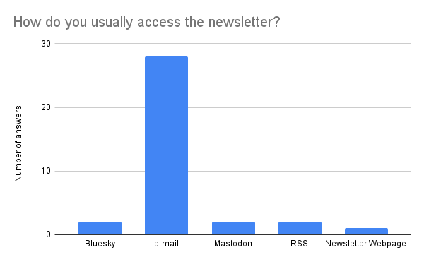
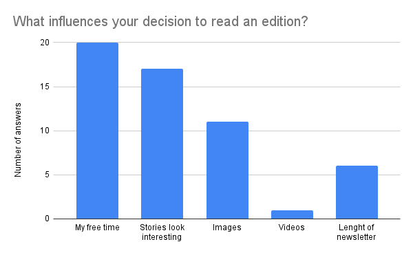
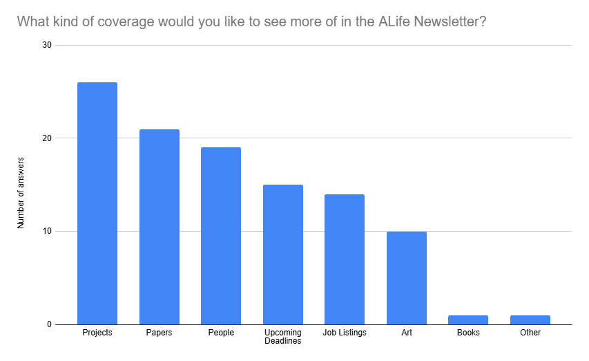
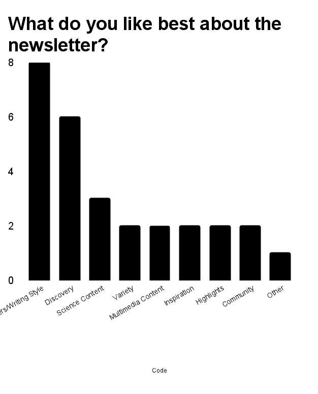
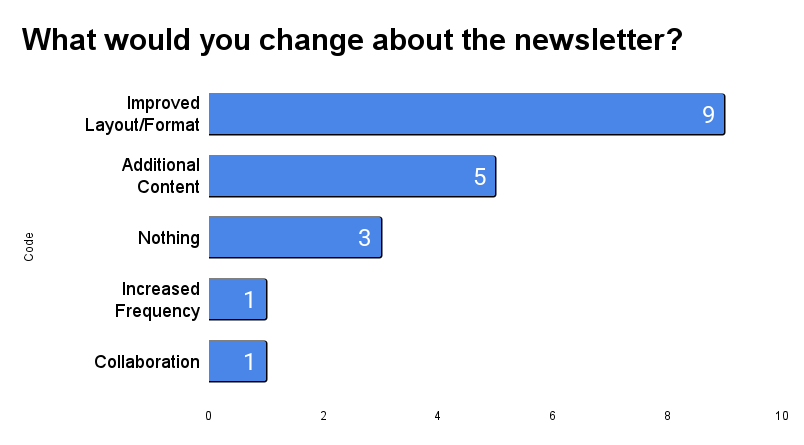
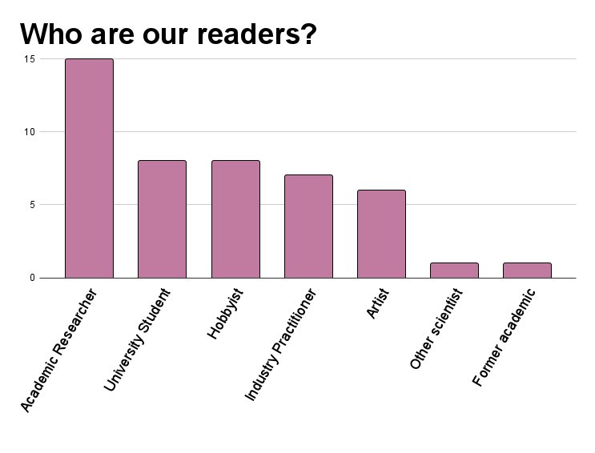

# The ALIFE Newsletter Community Survey: Numbers
*by Lana, Imy, Claus and Martha*

Early this year, we conducted a survey to learn who reads the Artificial Life Newsletter, and what they expect from it. Thanks to all of you who contributed to our survey. Your answers have given us a better idea of who is reading the Newsletter, what you like about our work, and how we could improve moving forward.
There are many lessons that we can take from your answers to the surveys. Below are some of the things that came to mind as we read up your responses.

Most of our respondents seem to have found us through social media or through our announcements at the ALife conference. We have been slacking a bit on the social media side, but it looks like it's worth putting the effort in!

Email is by far the most common way that you are reading the newsletter. But did you even know we have a RSS feed? We might not have been advertising it enough! It's right here: [https://alife-newsletter.github.io/Newsletter/RSS.xml](RSS feed)

A surprising number of subscribers read every edition! Or at least, the kind of people who tend to answer our surveys also tend to read every email from us...

Got it: images are important, and so are good titles for our stories. (But we promise not to turn everything into a youtube thumbnail)

One of our main goals with this survey was to learn what you enjoy about the Newsletter, so that we can do more of that. Summing up the different comments that we received, there was an overall theme of "Paper, People and Projects" as things that the readers most liked. 
We often include a list of interesting papers that we have found, so you can be sure that there will be more featured papers on the newsletter. The "People" part is interesting -- we used to make interviews, but they turned out to be very work intensive, and so we shifted focus to other things. But knowing that this was a favorite part of the newsletter gives us motivation to think of how add interviews again, hopefully without adding too much workload to the editorial team. That includes interviews with individuals, and also features on working groups and laboratories.

(On the other hand, very few people mentioned "book reviews" as one of the thing they liked in the newsletter, which was... interesting ^^;)

Thank you for showing some love to our writing team! We'll keep our text hand typed and AI free then.
On a similar topic, some comments that stood out to us were about how the variety of different voices and topics in each edition was a positive point. We are always happy to feature reader suggestions regarding what to cover, so please let us know what you would like to see featured in the newsletter. You may drop us a line using the feeback field at our [contribution form](https://forms.gle/jv7FdtdbWVTaTFGd9).

A common suggestion was to improve the Newsletter design. We will certainly look into reviewing our lovingly hand-crafted CSS, and also, if anyone among the readership has web-design experience, please do contact us!

We are glad to report that our readership is quite varied! Most of you are from outside academia, and within academia we have a good share of students. We will strive to keep our Newsletter full of things that appeal to all ALifers!

Although the Survey is over, we are always interested in hearing the opinions of our readers. Please do feel free to reach to us through social media (or our feedback form) with more comments and ideas about what you want to see in the Artificial Life Newsletter!
