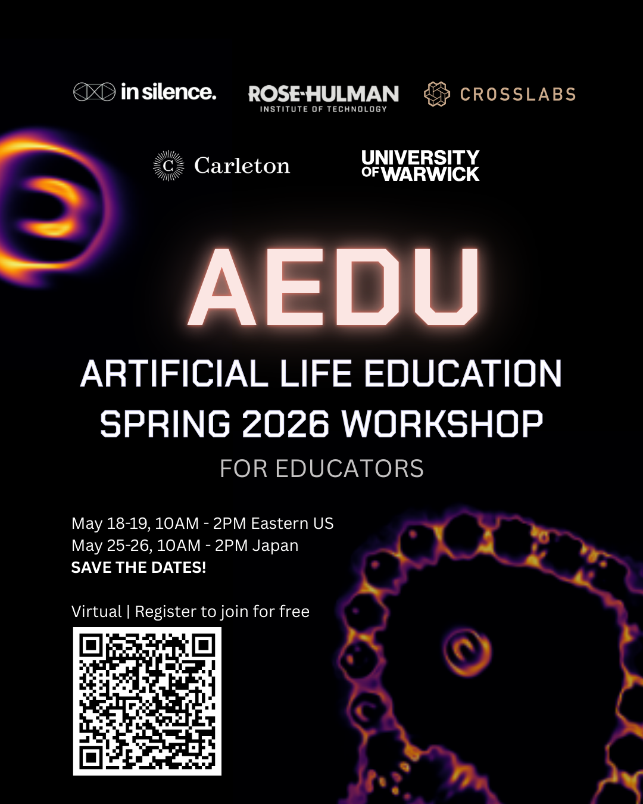

# ALife Education Virtual Workshop - May 2026

**Deadline to register:** May 1st 2026

**Workshop Dates:** Workshop 1: May 18 and 19. Workshop 2: May 25 and 26

**Registration link:** [https://alife-edu.github.io/aedu-virtual-workshop-2026.html](https://alife-edu.github.io/aedu-virtual-workshop-2026.html)

AEdu is a free, fully virtual two-day workshop in May 2026, bringing together educators and professionals across the globe to develop shared learning goals for ALife, and build a community around best practices for what (and how) we teach and assess "artificial life" concepts across the education spectrum.  We are aiming to collaboratively align education goals and efforts within the ALife community, to create shared resources as well as "best practices" to this end.

 
We are designing this workshop to be engaging and focused on widely applicable, high-value activities. The overall program will involve a variety of different presentation formats and collaborative activities. We are very excited to bring people together and explore challenges and opportunities!

We welcome interested educators around the globe to come and join us in our first iteration of this workshop.

Dates: The workshop takes place twice, once on May 18th+19th (suited for Europe/NA), and again on May 25th+26th (suited for Asia/Oceania). Although some of the content will be unique in each, they will share a parallel structure (e.g., some activities/presentations will be repeated) and thus we expect most people to choose to attend one workshop or the other. (i.e. Workshop 1 or Workshop 2)
 
More info here: https://alife-edu.github.io/aedu-virtual-workshop-2026.html

Organizers:
**Jason A. Yoder** - Rose-Hulman Institute of Technology (USA); **Q. Tyrell Davis** - Independent Researcher; **Jean Alfonso-Decena** - In Silence AI (Japan, Phillipines); **Imy Khan** - University of Warwick (UK); **Anya E. Vostinar** - Carleton College, (USA); **Alyssa Adams** - Cross Labs (Japan)
