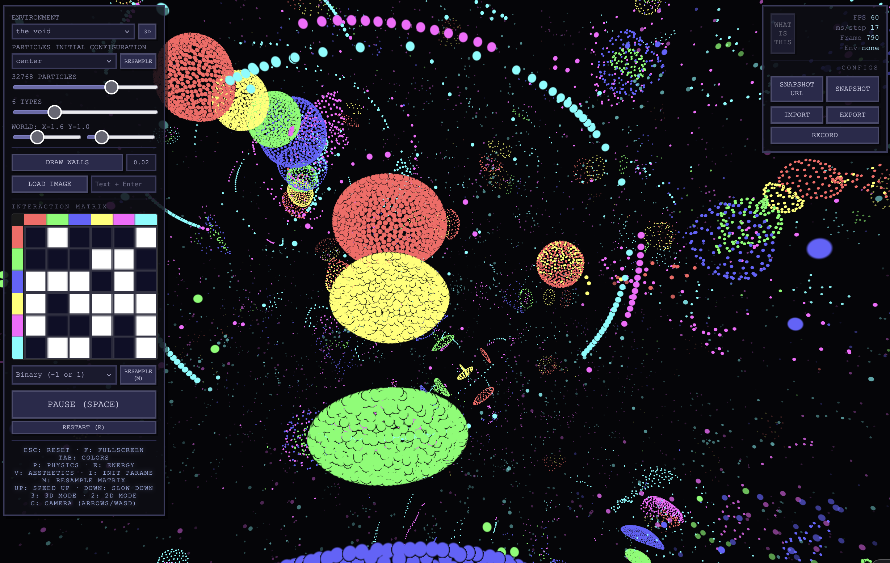

# 

[Elijas Najarro shared](https://bsky.app/profile/najarro.science/post/3miej7nquvc2n) a mesmerizing implementation of asymetric particle simulation in 3d that runs on browsers.
Go have a look, toggle the 3D setting and play with the parameters!

[https://najarro.science/pl/](https://najarro.science/pl/)

