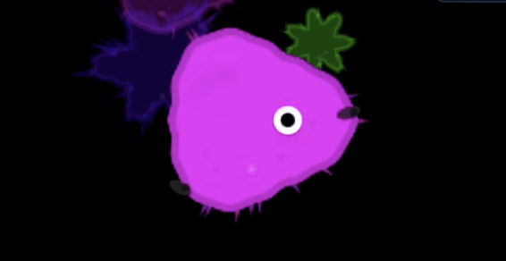
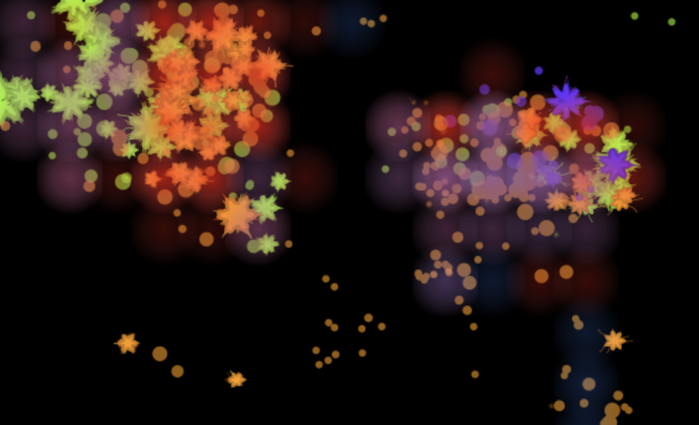
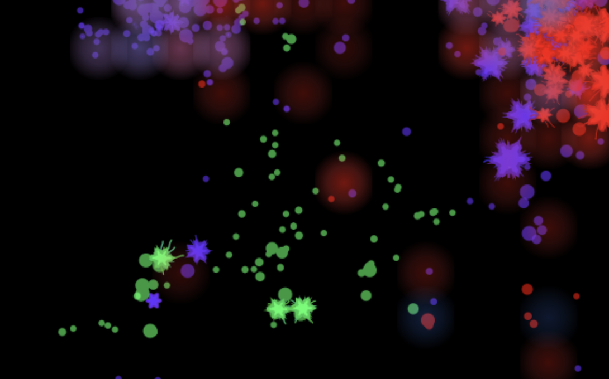
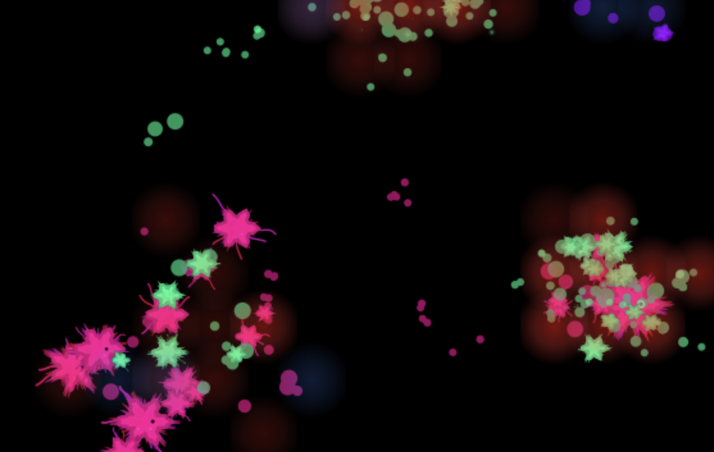
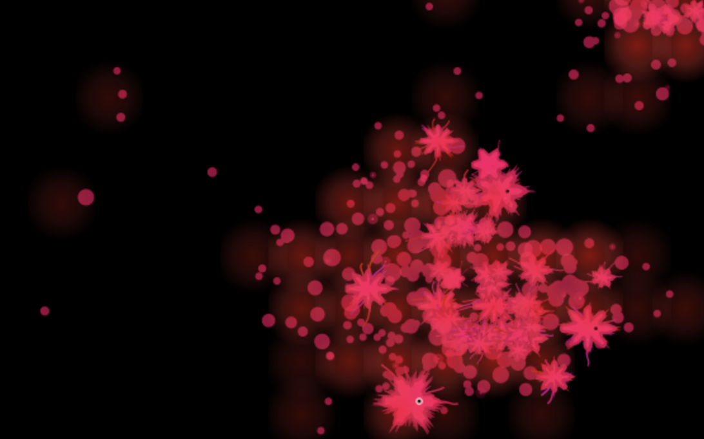
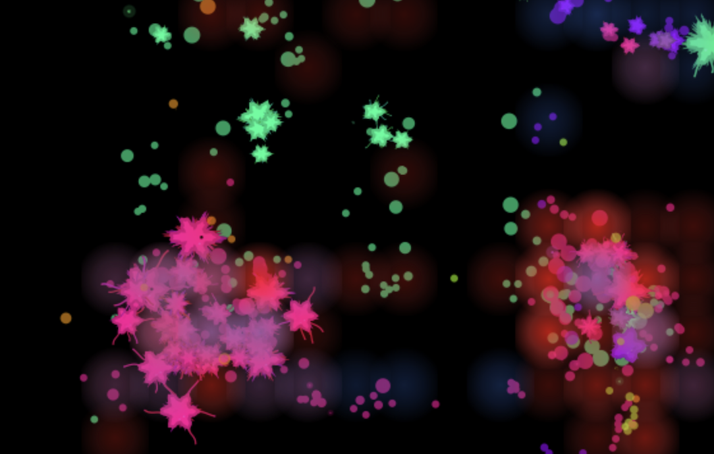
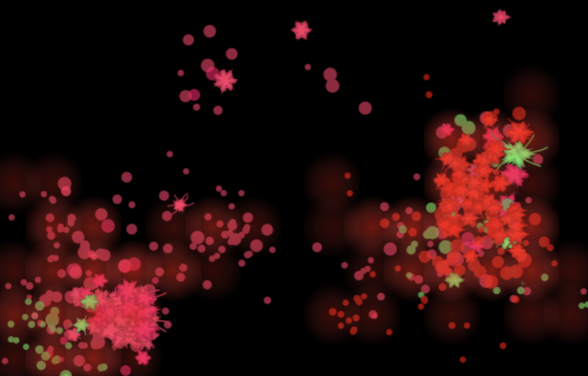
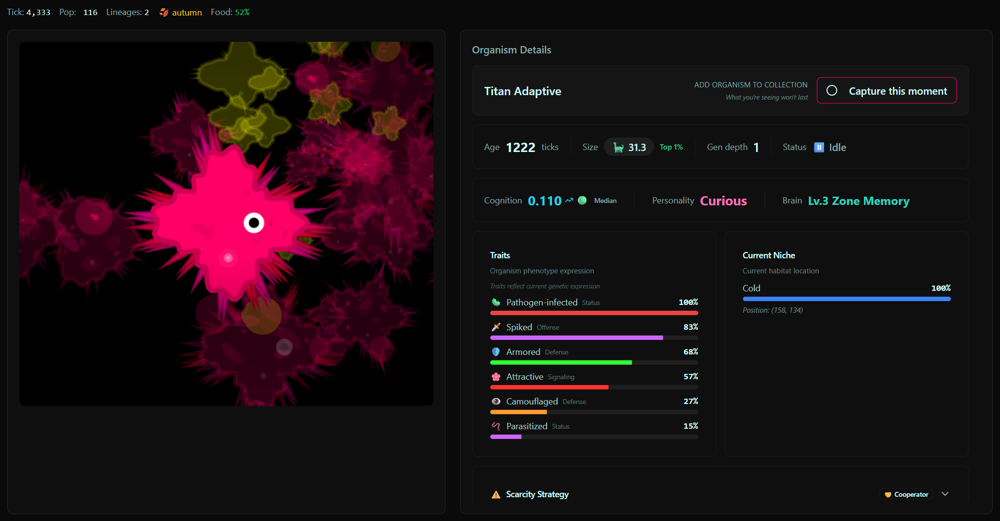
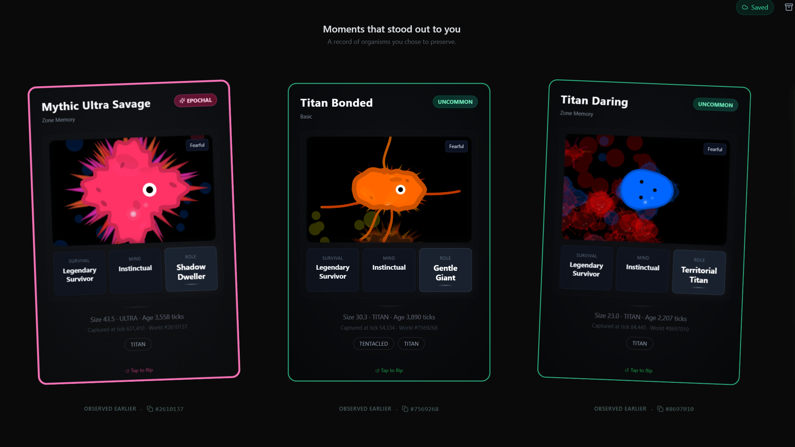
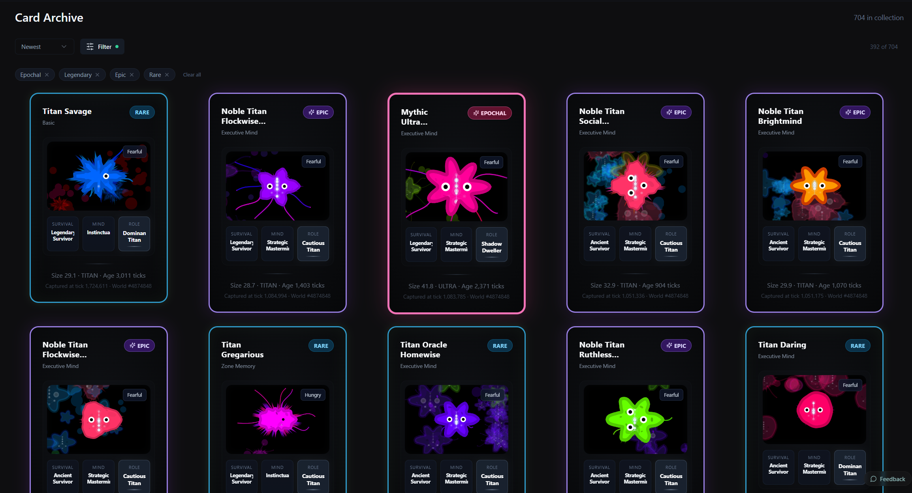

# A Conversation with the creator of Soup of Life

*I recently spoke with the creator of [Soup of Life](https://soupof.life) to learn more about how he evolved this simulation to model emergence. Here's what he had to say!*

— *Martha*

I've had a lot of fun exploring Soup of Life. What inspired you to create it?

Honestly, things just got out of hand.

I watched <a href="https://youtu.be/XX7PdJIGiCw">The Most Controversial Idea in Biology</a> one evening, took a screenshot of the replicator dynamics, and tried to rebuild it myself that same night to see if I could. It worked, the world came alive, and then I kept adding things. Controls for every little thing. Meteorites. A museum for organisms. A social feed for discoveries.

The moment I realised I'd gone wrong was when I noticed I was no longer observing. I was going for quick hits. What happens if I throw a storm in, set everything to scarce, force something to happen. It felt like finding a cheat code in a game you've been playing for weeks. You use it for an hour and then never play again. So I stripped all of it out. No controls, no likes, no god mode. Just life unfolding slowly.

It was also a bit of a protest, to be honest, against the two-second attention span and the doomscrolling, my own included. I wanted to spend time on something else, and along the way I ended up building something that unfolds slowly and where you have no controls.

I missed the slow, weird corners of the internet. People building strange things to see what happened, no metrics, no growth goals. Getting noticed in those places let me rediscover something I thought had gone. Smaller online communities I'd never heard of, people running worlds for weeks.

How did you first encounter the field of Artificial Life?

  
Completely by accident.

I had no idea it was a whole field when I started building. Once I found out it existed I posted the simulation in the ALife community myself, and from there people started reaching out. My first reaction was: I could have saved myself a lot of time. But I probably would also have given up earlier. A lot of what kept me going was discovering these concepts myself, stumbling into them through the simulation rather than reading about them first.

Then I felt a bit overwhelmed, because quite a few people reached out wanting to learn more or work together, and I had to figure out how to handle that without losing control of the project. I said no quite a lot early on, which felt harsh given that people were taking time to reach out. What worked better was being upfront from the start. This is a solo hobby project, here's what it is and isn't.

The community itself turned out to be warm and welcoming, full of enthusiasm and hard questions. Different from what I was used to.
 

Tell me more about your simulation.

  
It's a browser-based artificial life simulation. No goals, no controls. You open it and it starts immediately. Organisms are born, evolve, get sick, reproduce, go extinct. Sometimes they do things I've never seen before, and I've been running worlds for a long time now.

There's a lot happening under the surface. Morphology, metabolism, pathogens, zones, lineage tracking, cognition, narration. But what makes it interesting isn't any single system, it's what emerges when they interact over thousands of ticks. I still remember the first time a world produced a [stable organism with tiny tentacles](https://soupof.life/card/kbca5xk3). And the first time one survived past a million ticks without collapsing. Since then people online have found [organisms bigger and stranger than anything I've ever seen](https://soupof.life/card/wgwmwufv), and spotted patterns I hadn't noticed.

One thing that really made the world come alive for me was adding the microscope view, being able to zoom into an individual organism and actually see what's going on. It changed how I related to the simulation.

I see people use it in very different ways. As an aquarium running in the background during work. To collect and compare organisms. Or to dig into all the data it produces. I hadn't thought about it being used like that.

At some point I added a soundtrack that responds to what's actually happening. Births, deaths, population crashes, speciation. Felt fitting.

Every world is also fully reproducible from its seed now, so if someone runs a world on their laptop and someone else runs the same seed on their phone, they get the exact same history. I like that a lot. It means worlds aren't lost when you close them, and it opens up more ways to share them. I'm also working on a headless version for people who want to focus more on the data side.

The [concepts documentation](soupof.life/concepts) is there if you want to go deeper on what's simulated versus approximated.
 

How did your simulation evolve over time?

  
The first version was just replicator dynamics. Simple blobs competing for resources. From there I kept layering things on. Morphology, pathogens, zones, cognition. Each addition changed the dynamics in ways I didn't fully predict, which made it hard to stop.

At some point I committed to observation only, no controls, which forced the underlying systems to carry the experience on their own.

Then came the harder rebuild. Anya Vostinar, an ALife researcher, asked whether my mechanics were genuinely emergent or just designed to look that way. That sent me back into the codebase properly. I started by patching and fixing things, but every rock I turned I found things that were designed. Thresholds, shortcuts. After a couple of attempts I just made the decision: strip everything and rebuild with bottom-up as the only rule.
It took a very long time before worlds got interesting again. With so many systems interacting it felt almost like the butterfly effect, a small change somewhere rippled in unpredictable directions. But when worlds started evolving again it felt better than the first time. More earned.
 

What are some of the challenges you faced in building Soup of Life?

  
Running everything in the browser was a deliberate choice, partly for accessibility and partly because it means I don't need heavy hosting or infrastructure. But it puts real pressure on performance, which was one of the hardest things at the start. When I first posted it online I got a lot of feedback, insights and even code suggestions from forums that helped push the performance forward.

The other difficult one was getting the simulation to behave identically across different devices. Floating point math works subtly differently on different hardware, and those differences compound over millions of ticks until two worlds that started identical have quietly diverged. Getting that right took a lot of care but made it possible for anyone running the same seed to end up at the same world.

And then the rebuild itself. Patching didn't work. I had to strip everything and start over, running parallel sped-up worlds after each change to check what actually happened. I wanted to throw my laptop out of the window more than once. Most of what I removed turned out to be suppressing emergent behaviour rather than enabling it. [The world filled the gap on its own.](https://youtu.be/0qSC02SHZQs)
 

Tell me about your model.

Each tick runs roughly 40 computational phases. At the global level: a climate model, seasonal oscillations, pathogen co-evolution, and a resource economy across 48 zones.

Food is partitioned into four channels per zone: micro-food (favours [small bodies](https://soupof.life/card/cm3r86jg) with high surface-to-volume ratio), macro-food (gated by a sigmoid on body size, below a certain threshold you simply can't access it), clutter (rewards [agile foragers](https://soupof.life/card/msytrr1f), penalises [wide bodies](https://soupof.life/card/04vah36y)), and current strength (punishes [slow movers](https://soupof.life/card/goxs3fyc)). I tried simpler setups earlier and kept ending up with everything converging on a single generalist body plan. With four channels I started seeing distinct ecological optima along the size axis, so a [small grazer](https://soupof.life/card/0u0mp2nq) and a [titan](https://soupof.life/card/nuk5m7rt) aren't competing for the same food.

Energy is managed through a two-compartment DEB model. One fraction goes to maintenance and growth, the other to a reproductive buffer. The split scales with body plan: small [r-strategists](https://soupof.life/card/fo2f89ud) invest less in the soma and reproduce fast; large [K-strategists](https://soupof.life/card/0oyvjmq1) invest heavily in maintenance and defer reproduction across thousands of ticks. In my earlier single-pool version I couldn't get r- and K-strategists to coexist stably, things would tip one way or the other. Splitting the compartments seemed to let both persist.

Cognition has seven levels with real metabolic cost. At level 3 an organism can read the climate phase and start preparing for winter before conditions deteriorate. At level 6 it runs a forward model each tick, evaluating candidate actions against a lookahead of zone state, so you sometimes see organisms break off hunts when the target is leading them into a parasite-dense area. The cost scales quadratically with neural complexity, which is probably why high cognition only persists in my runs where there's stable surplus.

Parasites use 4D phenotype matching across size, defense, movement, and sociality. Infection probability depends on how closely the parasite's signature matches the host across all four dimensions. One thing I noticed after adding the sociality axis is that social clustering can function as a defensive strategy, because a parasite optimised for solitary hosts has to coevolve separately to exploit clustered ones.

Mortality is roughly 31 factors, but about five do most of the work in the runs I've analysed: senescence via a Gompertz curve, seasonal thermal exposure, starvation streaks, and trait-survival multipliers. The rest contribute less but seem to matter. When I've removed some of the smaller factors the worlds tend to narrow down quickly to one or two dominant strategies, though I haven't tested this systematically.

Evolution happens through heritable numeric traits with noise rather than discrete genes. I went with continuous traits partly because selection has a smoother gradient to work on every generation, and partly because it was simpler for me to reason about. The fat-tailed mutation kernel means most offspring stay close to the parent, but rare large jumps let lineages escape local optima. I'd be curious how this compares to what people using discrete architectures observe.

What I find most interesting in the data now is trait combinations. Some combinations seem to probe the fitness landscape, establish briefly, collapse, and then reappear millions of ticks later when conditions shift. It's as if they're waiting for the perfect storm. I didn't design that behaviour, and I'm still working out what to make of it.

I have a full tick-by-tick breakdown if any readers want to go deeper.
 

How has feedback shaped the evolution of your model?

In almost every direction.

My wife has a doctorate and teaches life sciences and evolution. She kept asking whether things actually made biological sense, what would realistically be selected for, where something felt hand-wavy. A lot got redone because of those conversations.

Anya Vostinar's question about emergence versus engineering sent me into the full rebuild. Probably the single most consequential piece of feedback the project received.

My kids shaped the interface more than I'd have guessed. My eldest wanted to zoom in and capture [organisms](https://soupof.life/featured), which became the microscope view and the card system. My youngest goes through his card collection. My middle one wants to trade cards with friends, so I'm thinking about that.

And then there's feedback from strangers. Bug reports, observations, someone who messaged me at the end of a workweek asking if there was a way to preserve their world because they didn't want to close it. I also like the fleetingness of a world, that it continues without you, that you catch a moment and then let it go. It's part of what the whole thing is about.
 

In what ways is community engagement built into Soup of Life?

The main thing is the organism card system. When you find an interesting organism you can capture it as a card, with its traits, lineage, state. Cards are shareable. I have around 680 myself. My favourite is [one that looks a bit like a lemon or a peanut](soupof.life/card/aqfvdb39). There's also a [big one with full tentacles and spikes](soupof.life/card/vsxx7ep8) that moves in groups with mesmerising patterns. That one sticks with me.

There's also a catch-up feature that generates a description of what's been happening in the world, which helps people make sense of what they're watching when they come back to a running world.

Making worlds deterministic opened up more sharing possibilities too. A world is no longer just yours, you can share the seed and someone else can run the exact same history.

Honestly though, there isn't really a community yet, at least not in an organised sense. People run worlds, capture organisms, share cards and worlds and send me messages. I'm curious to see where it goes.
 

Where do you see this going in the future?

A few directions.

I'm working on a headless version for people who want to focus more on the data side, without the browser interface. Some people, including folks from the ALife community, have asked about running things at scale, and making that possible feels like the right next step.

On the lighter side, my middle one wants to trade cards with friends. So I'm thinking about that too.

Longer term I want to keep bridging the gap between people with no science background and people who have one. A kid collecting organisms and someone running long replicates are using the same simulation for completely different reasons. I'd like to make both experiences better without compromising either.

My two favourite things about this whole project are still the same. People running worlds for weeks on end, and my kids calling me from another room to show off the latest organism they've spotted. If I can keep both of those happening I'll be happy.
 

