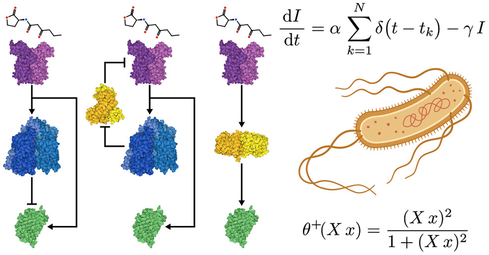

# Paper Review - Engineering Basal Cognition [Pla-Mauri \& Solé]

Written by [Imy](https://imytk.co.uk)

How does cognition arise without a nervous system? And what is the minimum genetic machinery needed to implement learning in a single cell? These are the questions that Pla-Mauri and Solé try to unpack in this recent paper. 

Taking a synthetic biology angle, they design minimal synthetic genetic circuits capable of reproducing a few types of adaptive behaviours in silico: habituation, sensitisation, and massed-spaced learning (a cognitive strategy in which learning sessions are distributed over time (spaced learning) rather than concentrated over a short period (massed learning)). All of the circuits used well-characterised regulatory parts (repressors, quorum-sensing molecules, fluorescent reporters). These design decisions are sufficiently grounded in biology to be to be experimentally realisable in *E. coli*, which is something I feel ALifers sometimes underappreciate. Being able to make concrete predictions of how the real world operates using such tractable models is *really* cool!

In essence, the authors find that these circuits actually work, BUT learning operates on timescales that are orders of magnitude slower than synaptic learning, which places hard constraints on what kinds of stimuli and environments such a system could adapt to. The authors discuss what this means for how these types of circuits might operate, and what trade-offs they may impose. I won't ruin that discussion here - you can read more in the paper!

It reminded me of a few other papers [1](https://doi.org/10.1098/rstb.2019.0750) [2](https://www.sciencedirect.com/science/article/abs/pii/S0006291X21001959) I've come across in recent times, in part inspired by [Pamela Lyon's keynote talk at ALIFE 2023](https://www.youtube.com/watch?v=I4hq3LUx73Y). 

It's a bit of a technical read in places, but overall I really enjoyed the writing style. The core circuit logic is presented clearly, and the parameter space analyses are intuitive. It's not tremendously long, and so worth checking out if you're interested in minimal cognition, synthetic biology, or just looking for a really nice example of how to write an excellent ALife paper.

