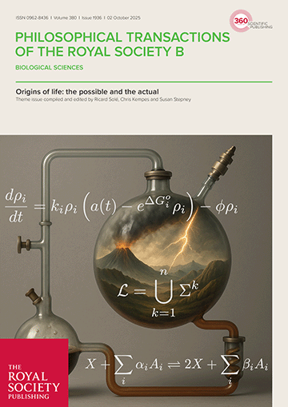

# Origins of life: the possible and the actual

This [theme issue](https://royalsocietypublishing.org/rstb/issue/380/1936) of Philosophical Transactions B should interest any reader who likes Origins of Life research, as well as related topics: Agency, Transitions, Evolution, Protocells, and of course Artificial Life!
The issue is from last year, but should remain relevant for many years to come.

Origins of life: the possible and the actual

