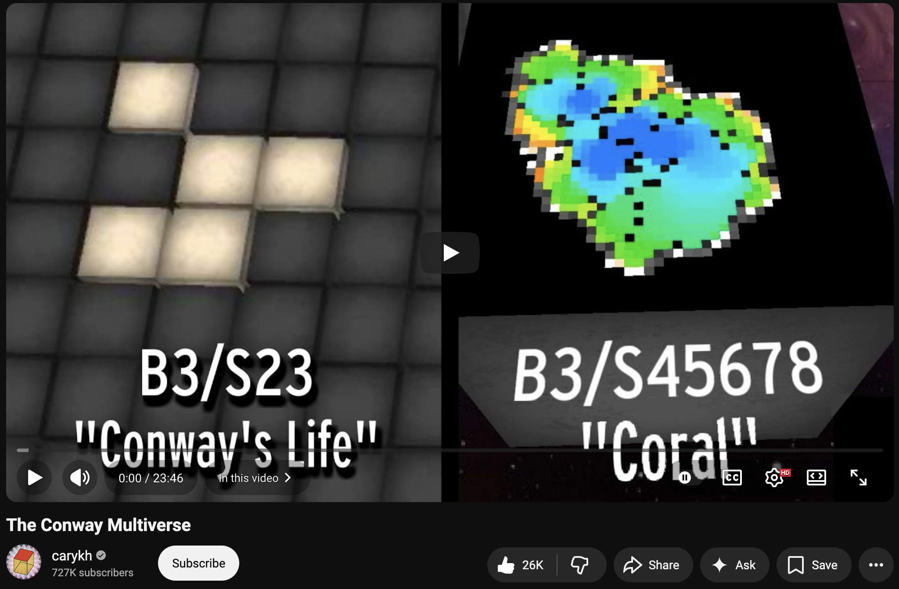

# Video: The Conway Multiverse by Cary Huang

Writeup: Lana

This video by Cary Huang explores the space of automaton rules adjacent to the Game of Life rules by J. Conway. It starts with an excellent primer on 2D binary automata, and continues with a discussion of what "stability" and "complexity" mean in the context of 2D automata.
The visualizations are gorgeous and make all of the concepts easy to understand. One caveat: Huang uses "chaotic" in several ways that do not correspond to classic definitions in complex systems.
Make sure to check out his channel, it is full of fun videos!

https://youtu.be/QK_KZv-YyOc?si=lu5JVxpXhLVzwnjA
