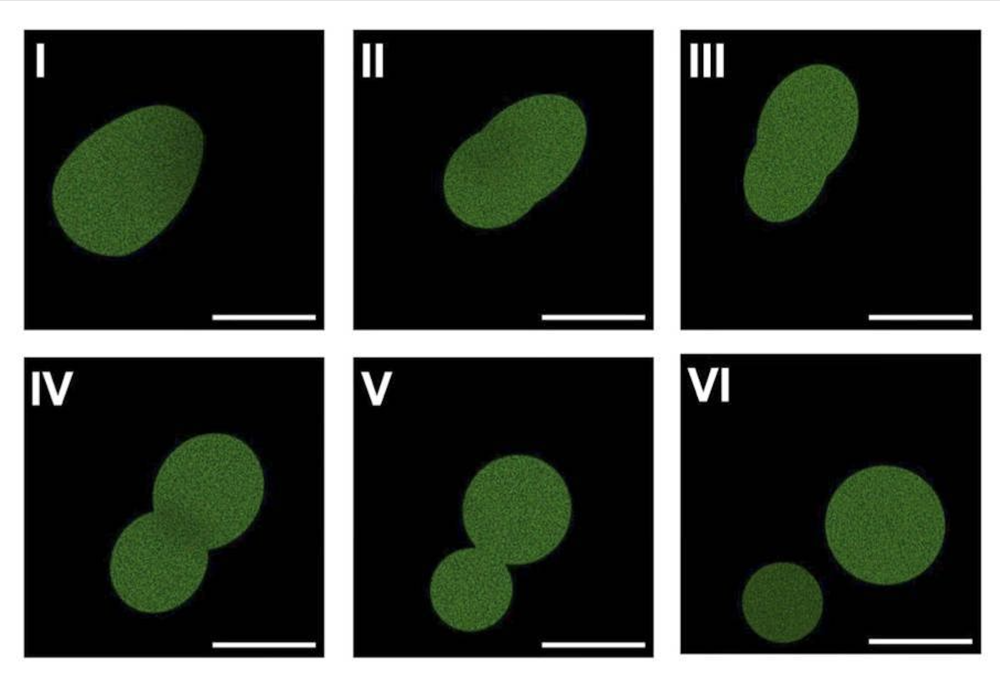

# News: Synthetic Life from SpudCells

*by Martha*

In the quest for synthetic life, scientists often rely on simple existing lifeforms as a scaffold. Kate Adamala's team at the University of Minnesota had a different idea: her team's SpudCells are built from scratch. The simple cells have a fatty outer layer with water in the middle, and "live" in a bath that provides the chemicals the SpudCells need to grow and divide. 

So here we have synthetic cells behaving somewhat like actual living cells. And what's really exciting here are the possibilities: how can these cells be used to model evolution? what are the minimum requirements for life? what would it take to make a synthetic cell self-reliant, and what would that tell us?

You can read more in the preprint, [here](https://www.biotic.org/research/spudcell/)

https://www.theguardian.com/science/2026/jul/01/synthetic-life-lab-made-dna-spudcells-scientists
