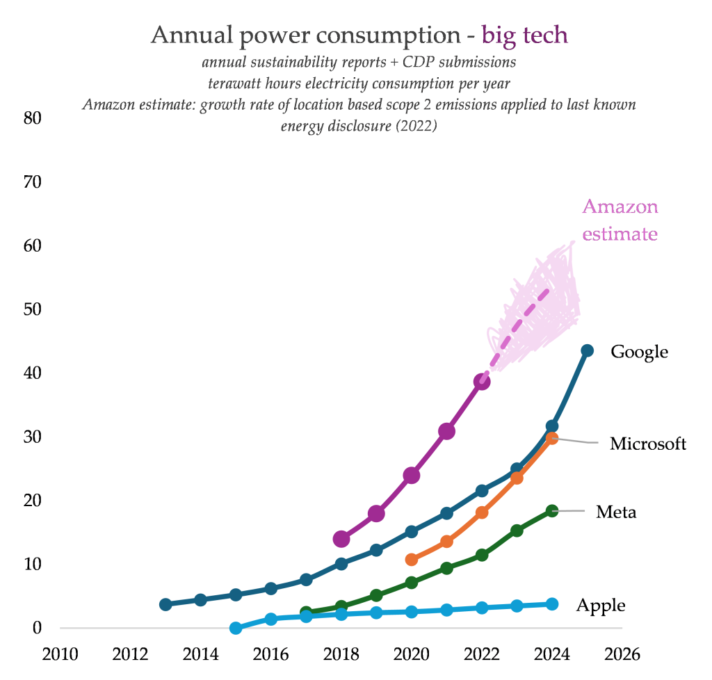

# The Climate Cost of LLMs

_by Claus_

Recently, the role of LLMs in research (both as research topics and
tools) has become a big topic of discussion, specially in ALIFE. 

Among the discussion of whether they are useful or not, and how they
relate with ALIFE-y topics such as agency and open-endedness, it is
essential not to lose sight of their **externalities**: In other
words, the ethical costs that this technology imposes on us and others. 

Recently, Ketan Joshi, a climate analyst and advocate, wrote (a deep
analysis of Google's yearly Climate
report)[https://ketanjoshi.co/2026/07/01/googles-exponential-path-to-climate-wrecking-digital-bloat/]
which is well worth reading. This analysis makes clear the rapidly
growing environmental costs of generative AI. 

We as ALIFE practitioners should make sure that we take this cost into
account when making decisions such as when and if to use this tools,
and whether to allow them in our conferences and journals.
